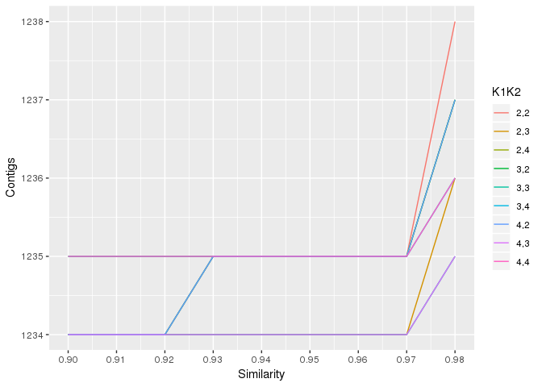

Week5
================
JonPuritz
2/27/2019

Creating a reference with data
==============================

1. Load conda environment for dDocent
-------------------------------------

``` bash
conda create -n Week5 ddocent
conda activate Week5
```

``` bash
source activate Week5
ReferenceOpt.sh
```

    ## Usage is sh ReferenceOpt.sh minK1 maxK1 minK2 maxK2 Assembly_Type Number_of_Processors
    ## 
    ## 
    ## 
    ## Optionally, a new range of similarities can be entered as well:
    ## ReferenceOpt.sh minK1 maxK1 minK2 maxK2 Assembly_Type Number_of_Processors minSim maxSim increment
    ## 
    ## For example, to scale between 0.95 and 0.99 using 0.005 increments:
    ## ReferenceOpt.sh minK1 maxK1 minK2 maxK2 Assembly_Type Number_of_Processors 0.95 0.99 0.005

``` bash
source activate Week5
ReferenceOpt.sh 2 4 2 4 PE 64 0.9 0.98 0.01
```

    K1 is 2 K2 is 2 c is 0.90
    K1 is 2 K2 is 2 c is 0.91
    K1 is 2 K2 is 2 c is 0.92
    K1 is 2 K2 is 2 c is 0.93
    K1 is 2 K2 is 2 c is 0.94
    K1 is 2 K2 is 2 c is 0.95
    K1 is 2 K2 is 2 c is 0.96
    K1 is 2 K2 is 2 c is 0.97
    K1 is 2 K2 is 2 c is 0.98
    K1 is 2 K2 is 3 c is 0.90
    K1 is 2 K2 is 3 c is 0.91
    K1 is 2 K2 is 3 c is 0.92
    K1 is 2 K2 is 3 c is 0.93
    K1 is 2 K2 is 3 c is 0.94
    K1 is 2 K2 is 3 c is 0.95
    K1 is 2 K2 is 3 c is 0.96
    K1 is 2 K2 is 3 c is 0.97
    K1 is 2 K2 is 3 c is 0.98
    K1 is 2 K2 is 4 c is 0.90
    K1 is 2 K2 is 4 c is 0.91
    K1 is 2 K2 is 4 c is 0.92
    K1 is 2 K2 is 4 c is 0.93
    K1 is 2 K2 is 4 c is 0.94
    K1 is 2 K2 is 4 c is 0.95
    K1 is 2 K2 is 4 c is 0.96
    K1 is 2 K2 is 4 c is 0.97
    K1 is 2 K2 is 4 c is 0.98
    K1 is 3 K2 is 2 c is 0.90
    K1 is 3 K2 is 2 c is 0.91
    K1 is 3 K2 is 2 c is 0.92
    K1 is 3 K2 is 2 c is 0.93
    K1 is 3 K2 is 2 c is 0.94
    K1 is 3 K2 is 2 c is 0.95
    K1 is 3 K2 is 2 c is 0.96
    K1 is 3 K2 is 2 c is 0.97
    K1 is 3 K2 is 2 c is 0.98
    K1 is 3 K2 is 3 c is 0.90
    K1 is 3 K2 is 3 c is 0.91
    K1 is 3 K2 is 3 c is 0.92
    K1 is 3 K2 is 3 c is 0.93
    K1 is 3 K2 is 3 c is 0.94
    K1 is 3 K2 is 3 c is 0.95
    K1 is 3 K2 is 3 c is 0.96
    K1 is 3 K2 is 3 c is 0.97
    K1 is 3 K2 is 3 c is 0.98
    K1 is 3 K2 is 4 c is 0.90
    K1 is 3 K2 is 4 c is 0.91
    K1 is 3 K2 is 4 c is 0.92
    K1 is 3 K2 is 4 c is 0.93
    K1 is 3 K2 is 4 c is 0.94
    K1 is 3 K2 is 4 c is 0.95
    K1 is 3 K2 is 4 c is 0.96
    K1 is 3 K2 is 4 c is 0.97
    K1 is 3 K2 is 4 c is 0.98
    K1 is 4 K2 is 2 c is 0.90
    K1 is 4 K2 is 2 c is 0.91
    K1 is 4 K2 is 2 c is 0.92
    K1 is 4 K2 is 2 c is 0.93
    K1 is 4 K2 is 2 c is 0.94
    K1 is 4 K2 is 2 c is 0.95
    K1 is 4 K2 is 2 c is 0.96
    K1 is 4 K2 is 2 c is 0.97
    K1 is 4 K2 is 2 c is 0.98
    K1 is 4 K2 is 3 c is 0.90
    K1 is 4 K2 is 3 c is 0.91
    K1 is 4 K2 is 3 c is 0.92
    K1 is 4 K2 is 3 c is 0.93
    K1 is 4 K2 is 3 c is 0.94
    K1 is 4 K2 is 3 c is 0.95
    K1 is 4 K2 is 3 c is 0.96
    K1 is 4 K2 is 3 c is 0.97
    K1 is 4 K2 is 3 c is 0.98
    K1 is 4 K2 is 4 c is 0.90
    K1 is 4 K2 is 4 c is 0.91
    K1 is 4 K2 is 4 c is 0.92
    K1 is 4 K2 is 4 c is 0.93
    K1 is 4 K2 is 4 c is 0.94
    K1 is 4 K2 is 4 c is 0.95
    K1 is 4 K2 is 4 c is 0.96
    K1 is 4 K2 is 4 c is 0.97
    K1 is 4 K2 is 4 c is 0.98


                                                       Histogram of number of reference contigs

                           80 +-----------------------------------------------------------------------------------------+
                              |        +        +        +        +        *        +        +        +        +        |
                              |                                 'plot.kopt.*ata' using (bin($1,binwidth)):(1.0) ******* |
                           70 |-+                                          *                                          +-|
                              |                                            *                                            |
                              |                                            *                                            |
                           60 |-+                                          *                                          +-|
                              |                                            *                                            |
                              |                                            *                                            |
                           50 |-+                                          *                                          +-|
                              |                                            *                                            |
                           40 |-+                                          *                                          +-|
                              |                                            *                                            |
                              |                                            *                                            |
                           30 |-+                                          *                                          +-|
                              |                                            *                                            |
                              |                                            *                                            |
                           20 |-+                                          *                                          +-|
                              |                                            *                                            |
                              |                                            *                                            |
                           10 |-+                                          *                                          +-|
                              |                                            *                                            |
                              |        +        +        +        +        *        +        +        +        +        |
                            0 +-----------------------------------------------------------------------------------------+
                            1235.5    1236    1236.5    1237    1237.5    1238    1238.5    1239    1239.5    1240    1240.5
                                                              Number of reference contigs

    Average contig number = 1234.74
    The top three most common number of contigs
    X   Contig number
    41  1235
    33  1234
    3   1237
    The top three most common number of contigs (with values rounded)
    X   Contig number
    81  1200

Let's graph some more data
--------------------------

``` r
library(ggplot2)

data.table <- read.table("kopt.data", header = FALSE, col.names= c("k1","k2","Similarity", "Contigs"))

data.table$K1K2 <- paste(data.table$k1, data.table$k2, sep=",")

df=data.frame(data.table)
df$K1K2 <- as.factor(df$K1K2)

p <- ggplot(df, aes(x=Similarity, y=Contigs, group=K1K2)) + scale_x_continuous(breaks=seq(0.8,0.98,0.01)) + geom_line(aes(colour = K1K2))
p
```



It seems like differentiation changes at about 97% with perhaps a secondary change at 92%

Let's try 96% (right after the inflection), but first we need to trim the read files

``` bash
cat config
```

    ## Number of Processors
    ## 24
    ## Maximum Memory
    ## 0
    ## Trimming
    ## yes
    ## Assembly?
    ## no
    ## Type_of_Assembly
    ## 
    ## Clustering_Similarity%
    ## 
    ## Minimum within individual coverage level to include a read for assembly (K1)
    ## 5
    ## Minimum number of individuals a read must be present in to include for assembly (K2)
    ## 6
    ## Mapping_Reads?
    ## no
    ## Mapping_Match_Value
    ## 1
    ## Mapping_MisMatch_Value
    ## 3
    ## Mapping_GapOpen_Penalty
    ## 5
    ## Calling_SNPs?
    ## no
    ## Email
    ## jpuritz@gmail.com

``` bash
source activate Week5
dDocent config
```

    ## dDocent 2.6.0 
    ## 
    ## Contact jpuritz@uri.edu with any problems 
    ## 
    ##  
    ## Checking for required software
    ## 
    ## All required software is installed!
    ## 
    ## dDocent run started Wed Feb 27 09:12:59 EST 2019 
    ## 
    ## At this point, all configuration information has been entered and dDocent may take several hours to run.
    ## It is recommended that you move this script to a background operation and disable terminal input and output.
    ## All data and logfiles will still be recorded.
    ## To do this:
    ## Press control and Z simultaneously
    ## Type 'bg' without the quotes and press enter
    ## Type 'disown -h' again without the quotes and press enter
    ## 
    ## Now sit back, relax, and wait for your analysis to finish
    ## 
    ## Trimming reads

No, let's run RefMapOpt

``` bash
source activate Week5
RefMapOpt.sh
```

    Usage is RefMapOpt minK1 maxK1 minK2 maxK2 cluster_similarity Assembly_Type Num_of_Processors optional_list_of_individuals

``` bash
source activate Week5
RefMapOpt.sh 2 5 2 5 0.96 PE 48
```

    Trimmed sequences found, proceeding with optimization.
    [bam_sort_core] merging from 0 files and 48 in-memory blocks...
    [bam_sort_core] merging from 0 files and 48 in-memory blocks...
    [bam_sort_core] merging from 0 files and 48 in-memory blocks...
    [bam_sort_core] merging from 0 files and 48 in-memory blocks...
    [bam_sort_core] merging from 0 files and 48 in-memory blocks...
    [bam_sort_core] merging from 0 files and 48 in-memory blocks...
    [bam_sort_core] merging from 0 files and 48 in-memory blocks...
    [bam_sort_core] merging from 0 files and 48 in-memory blocks...
    [bam_sort_core] merging from 0 files and 48 in-memory blocks...
    [bam_sort_core] merging from 0 files and 48 in-memory blocks...
    [bam_sort_core] merging from 0 files and 48 in-memory blocks...
    [bam_sort_core] merging from 0 files and 48 in-memory blocks...
    [bam_sort_core] merging from 0 files and 48 in-memory blocks...
    [bam_sort_core] merging from 0 files and 48 in-memory blocks...
    [bam_sort_core] merging from 0 files and 48 in-memory blocks...
    [bam_sort_core] merging from 0 files and 48 in-memory blocks...
    [bam_sort_core] merging from 0 files and 48 in-memory blocks...
    [bam_sort_core] merging from 0 files and 48 in-memory blocks...
    [bam_sort_core] merging from 0 files and 48 in-memory blocks...
    [bam_sort_core] merging from 0 files and 48 in-memory blocks...
    [bam_sort_core] merging from 0 files and 48 in-memory blocks...
    [bam_sort_core] merging from 0 files and 48 in-memory blocks...
    [bam_sort_core] merging from 0 files and 48 in-memory blocks...
    [bam_sort_core] merging from 0 files and 48 in-memory blocks...
    [bam_sort_core] merging from 0 files and 48 in-memory blocks...
    [bam_sort_core] merging from 0 files and 48 in-memory blocks...
    [bam_sort_core] merging from 0 files and 48 in-memory blocks...
    [bam_sort_core] merging from 0 files and 48 in-memory blocks...
    [bam_sort_core] merging from 0 files and 48 in-memory blocks...
    [bam_sort_core] merging from 0 files and 48 in-memory blocks...
    [bam_sort_core] merging from 0 files and 48 in-memory blocks...
    [bam_sort_core] merging from 0 files and 48 in-memory blocks...
    [bam_sort_core] merging from 0 files and 48 in-memory blocks...
    [bam_sort_core] merging from 0 files and 48 in-memory blocks...
    [bam_sort_core] merging from 0 files and 48 in-memory blocks...
    [bam_sort_core] merging from 0 files and 48 in-memory blocks...
    [bam_sort_core] merging from 0 files and 48 in-memory blocks...
    [bam_sort_core] merging from 0 files and 48 in-memory blocks...
    [bam_sort_core] merging from 0 files and 48 in-memory blocks...
    [bam_sort_core] merging from 0 files and 48 in-memory blocks...
    [bam_sort_core] merging from 0 files and 48 in-memory blocks...
    [bam_sort_core] merging from 0 files and 48 in-memory blocks...
    [bam_sort_core] merging from 0 files and 48 in-memory blocks...
    [bam_sort_core] merging from 0 files and 48 in-memory blocks...
    [bam_sort_core] merging from 0 files and 48 in-memory blocks...
    [bam_sort_core] merging from 0 files and 48 in-memory blocks...
    [bam_sort_core] merging from 0 files and 48 in-memory blocks...
    [bam_sort_core] merging from 0 files and 48 in-memory blocks...
    [bam_sort_core] merging from 0 files and 48 in-memory blocks...
    [bam_sort_core] merging from 0 files and 48 in-memory blocks...
    [bam_sort_core] merging from 0 files and 48 in-memory blocks...
    [bam_sort_core] merging from 0 files and 48 in-memory blocks...
    [bam_sort_core] merging from 0 files and 48 in-memory blocks...
    [bam_sort_core] merging from 0 files and 48 in-memory blocks...
    [bam_sort_core] merging from 0 files and 48 in-memory blocks...
    [bam_sort_core] merging from 0 files and 48 in-memory blocks...
    [bam_sort_core] merging from 0 files and 48 in-memory blocks...
    [bam_sort_core] merging from 0 files and 48 in-memory blocks...
    [bam_sort_core] merging from 0 files and 48 in-memory blocks...
    [bam_sort_core] merging from 0 files and 48 in-memory blocks...
    [bam_sort_core] merging from 0 files and 48 in-memory blocks...
    [bam_sort_core] merging from 0 files and 48 in-memory blocks...
    [bam_sort_core] merging from 0 files and 48 in-memory blocks...
    [bam_sort_core] merging from 0 files and 48 in-memory blocks...
    [bam_sort_core] merging from 0 files and 48 in-memory blocks...
    [bam_sort_core] merging from 0 files and 48 in-memory blocks...
    [bam_sort_core] merging from 0 files and 48 in-memory blocks...
    [bam_sort_core] merging from 0 files and 48 in-memory blocks...
    [bam_sort_core] merging from 0 files and 48 in-memory blocks...
    [bam_sort_core] merging from 0 files and 48 in-memory blocks...
    [bam_sort_core] merging from 0 files and 48 in-memory blocks...
    [bam_sort_core] merging from 0 files and 48 in-memory blocks...
    [bam_sort_core] merging from 0 files and 48 in-memory blocks...
    [bam_sort_core] merging from 0 files and 48 in-memory blocks...
    [bam_sort_core] merging from 0 files and 48 in-memory blocks...
    [bam_sort_core] merging from 0 files and 48 in-memory blocks...
    [bam_sort_core] merging from 0 files and 48 in-memory blocks...
    [bam_sort_core] merging from 0 files and 48 in-memory blocks...
    [bam_sort_core] merging from 0 files and 48 in-memory blocks...
    [bam_sort_core] merging from 0 files and 48 in-memory blocks...
    [bam_sort_core] merging from 0 files and 48 in-memory blocks...
    [bam_sort_core] merging from 0 files and 48 in-memory blocks...
    [bam_sort_core] merging from 0 files and 48 in-memory blocks...
    [bam_sort_core] merging from 0 files and 48 in-memory blocks...
    [bam_sort_core] merging from 0 files and 48 in-memory blocks...
    [bam_sort_core] merging from 0 files and 48 in-memory blocks...
    [bam_sort_core] merging from 0 files and 48 in-memory blocks...
    [bam_sort_core] merging from 0 files and 48 in-memory blocks...
    [bam_sort_core] merging from 0 files and 48 in-memory blocks...
    [bam_sort_core] merging from 0 files and 48 in-memory blocks...
    [bam_sort_core] merging from 0 files and 48 in-memory blocks...
    [bam_sort_core] merging from 0 files and 48 in-memory blocks...
    [bam_sort_core] merging from 0 files and 48 in-memory blocks...
    [bam_sort_core] merging from 0 files and 48 in-memory blocks...
    [bam_sort_core] merging from 0 files and 48 in-memory blocks...
    [bam_sort_core] merging from 0 files and 48 in-memory blocks...
    [bam_sort_core] merging from 0 files and 48 in-memory blocks...
    [bam_sort_core] merging from 0 files and 48 in-memory blocks...
    [bam_sort_core] merging from 0 files and 48 in-memory blocks...
    [bam_sort_core] merging from 0 files and 48 in-memory blocks...
    [bam_sort_core] merging from 0 files and 48 in-memory blocks...
    [bam_sort_core] merging from 0 files and 48 in-memory blocks...
    [bam_sort_core] merging from 0 files and 48 in-memory blocks...
    [bam_sort_core] merging from 0 files and 48 in-memory blocks...
    [bam_sort_core] merging from 0 files and 48 in-memory blocks...
    [bam_sort_core] merging from 0 files and 48 in-memory blocks...
    [bam_sort_core] merging from 0 files and 48 in-memory blocks...
    [bam_sort_core] merging from 0 files and 48 in-memory blocks...
    [bam_sort_core] merging from 0 files and 48 in-memory blocks...
    [bam_sort_core] merging from 0 files and 48 in-memory blocks...
    [bam_sort_core] merging from 0 files and 48 in-memory blocks...
    [bam_sort_core] merging from 0 files and 48 in-memory blocks...
    [bam_sort_core] merging from 0 files and 48 in-memory blocks...
    [bam_sort_core] merging from 0 files and 48 in-memory blocks...
    [bam_sort_core] merging from 0 files and 48 in-memory blocks...
    [bam_sort_core] merging from 0 files and 48 in-memory blocks...
    [bam_sort_core] merging from 0 files and 48 in-memory blocks...
    [bam_sort_core] merging from 0 files and 48 in-memory blocks...
    [bam_sort_core] merging from 0 files and 48 in-memory blocks...
    [bam_sort_core] merging from 0 files and 48 in-memory blocks...
    [bam_sort_core] merging from 0 files and 48 in-memory blocks...
    [bam_sort_core] merging from 0 files and 48 in-memory blocks...
    [bam_sort_core] merging from 0 files and 48 in-memory blocks...
    [bam_sort_core] merging from 0 files and 48 in-memory blocks...
    [bam_sort_core] merging from 0 files and 48 in-memory blocks...
    [bam_sort_core] merging from 0 files and 48 in-memory blocks...
    [bam_sort_core] merging from 0 files and 48 in-memory blocks...
    [bam_sort_core] merging from 0 files and 48 in-memory blocks...
    [bam_sort_core] merging from 0 files and 48 in-memory blocks...
    [bam_sort_core] merging from 0 files and 48 in-memory blocks...
    [bam_sort_core] merging from 0 files and 48 in-memory blocks...
    [bam_sort_core] merging from 0 files and 48 in-memory blocks...
    [bam_sort_core] merging from 0 files and 48 in-memory blocks...
    [bam_sort_core] merging from 0 files and 48 in-memory blocks...
    [bam_sort_core] merging from 0 files and 48 in-memory blocks...
    [bam_sort_core] merging from 0 files and 48 in-memory blocks...
    [bam_sort_core] merging from 0 files and 48 in-memory blocks...
    [bam_sort_core] merging from 0 files and 48 in-memory blocks...
    [bam_sort_core] merging from 0 files and 48 in-memory blocks...
    [bam_sort_core] merging from 0 files and 48 in-memory blocks...
    [bam_sort_core] merging from 0 files and 48 in-memory blocks...
    [bam_sort_core] merging from 0 files and 48 in-memory blocks...
    [bam_sort_core] merging from 0 files and 48 in-memory blocks...
    [bam_sort_core] merging from 0 files and 48 in-memory blocks...
    [bam_sort_core] merging from 0 files and 48 in-memory blocks...
    [bam_sort_core] merging from 0 files and 48 in-memory blocks...
    [bam_sort_core] merging from 0 files and 48 in-memory blocks...
    [bam_sort_core] merging from 0 files and 48 in-memory blocks...
    [bam_sort_core] merging from 0 files and 48 in-memory blocks...
    [bam_sort_core] merging from 0 files and 48 in-memory blocks...
    [bam_sort_core] merging from 0 files and 48 in-memory blocks...
    [bam_sort_core] merging from 0 files and 48 in-memory blocks...
    [bam_sort_core] merging from 0 files and 48 in-memory blocks...
    [bam_sort_core] merging from 0 files and 48 in-memory blocks...
    [bam_sort_core] merging from 0 files and 48 in-memory blocks...
    [bam_sort_core] merging from 0 files and 48 in-memory blocks...
    [bam_sort_core] merging from 0 files and 48 in-memory blocks...
    [bam_sort_core] merging from 0 files and 48 in-memory blocks...
    [bam_sort_core] merging from 0 files and 48 in-memory blocks...
    [bam_sort_core] merging from 0 files and 48 in-memory blocks...
    [bam_sort_core] merging from 0 files and 48 in-memory blocks...
    [bam_sort_core] merging from 0 files and 48 in-memory blocks...
    [bam_sort_core] merging from 0 files and 48 in-memory blocks...
    [bam_sort_core] merging from 0 files and 48 in-memory blocks...
    [bam_sort_core] merging from 0 files and 48 in-memory blocks...
    [bam_sort_core] merging from 0 files and 48 in-memory blocks...
    [bam_sort_core] merging from 0 files and 48 in-memory blocks...
    [bam_sort_core] merging from 0 files and 48 in-memory blocks...
    [bam_sort_core] merging from 0 files and 48 in-memory blocks...
    [bam_sort_core] merging from 0 files and 48 in-memory blocks...
    [bam_sort_core] merging from 0 files and 48 in-memory blocks...
    [bam_sort_core] merging from 0 files and 48 in-memory blocks...
    [bam_sort_core] merging from 0 files and 48 in-memory blocks...
    [bam_sort_core] merging from 0 files and 48 in-memory blocks...
    [bam_sort_core] merging from 0 files and 48 in-memory blocks...
    [bam_sort_core] merging from 0 files and 48 in-memory blocks...
    [bam_sort_core] merging from 0 files and 48 in-memory blocks...
    [bam_sort_core] merging from 0 files and 48 in-memory blocks...
    [bam_sort_core] merging from 0 files and 48 in-memory blocks...
    [bam_sort_core] merging from 0 files and 48 in-memory blocks...
    [bam_sort_core] merging from 0 files and 48 in-memory blocks...
    [bam_sort_core] merging from 0 files and 48 in-memory blocks...
    [bam_sort_core] merging from 0 files and 48 in-memory blocks...
    [bam_sort_core] merging from 0 files and 48 in-memory blocks...
    [bam_sort_core] merging from 0 files and 48 in-memory blocks...
    [bam_sort_core] merging from 0 files and 48 in-memory blocks...
    [bam_sort_core] merging from 0 files and 48 in-memory blocks...
    [bam_sort_core] merging from 0 files and 48 in-memory blocks...
    [bam_sort_core] merging from 0 files and 48 in-memory blocks...
    [bam_sort_core] merging from 0 files and 48 in-memory blocks...
    [bam_sort_core] merging from 0 files and 48 in-memory blocks...
    [bam_sort_core] merging from 0 files and 48 in-memory blocks...
    [bam_sort_core] merging from 0 files and 48 in-memory blocks...
    [bam_sort_core] merging from 0 files and 48 in-memory blocks...
    [bam_sort_core] merging from 0 files and 48 in-memory blocks...
    [bam_sort_core] merging from 0 files and 48 in-memory blocks...
    [bam_sort_core] merging from 0 files and 48 in-memory blocks...
    [bam_sort_core] merging from 0 files and 48 in-memory blocks...
    [bam_sort_core] merging from 0 files and 48 in-memory blocks...
    [bam_sort_core] merging from 0 files and 48 in-memory blocks...
    [bam_sort_core] merging from 0 files and 48 in-memory blocks...
    [bam_sort_core] merging from 0 files and 48 in-memory blocks...
    [bam_sort_core] merging from 0 files and 48 in-memory blocks...
    [bam_sort_core] merging from 0 files and 48 in-memory blocks...
    [bam_sort_core] merging from 0 files and 48 in-memory blocks...
    [bam_sort_core] merging from 0 files and 48 in-memory blocks...
    [bam_sort_core] merging from 0 files and 48 in-memory blocks...
    [bam_sort_core] merging from 0 files and 48 in-memory blocks...
    [bam_sort_core] merging from 0 files and 48 in-memory blocks...
    [bam_sort_core] merging from 0 files and 48 in-memory blocks...
    [bam_sort_core] merging from 0 files and 48 in-memory blocks...
    [bam_sort_core] merging from 0 files and 48 in-memory blocks...
    [bam_sort_core] merging from 0 files and 48 in-memory blocks...
    [bam_sort_core] merging from 0 files and 48 in-memory blocks...
    [bam_sort_core] merging from 0 files and 48 in-memory blocks...
    [bam_sort_core] merging from 0 files and 48 in-memory blocks...
    [bam_sort_core] merging from 0 files and 48 in-memory blocks...
    [bam_sort_core] merging from 0 files and 48 in-memory blocks...
    [bam_sort_core] merging from 0 files and 48 in-memory blocks...
    [bam_sort_core] merging from 0 files and 48 in-memory blocks...
    [bam_sort_core] merging from 0 files and 48 in-memory blocks...
    [bam_sort_core] merging from 0 files and 48 in-memory blocks...
    [bam_sort_core] merging from 0 files and 48 in-memory blocks...
    [bam_sort_core] merging from 0 files and 48 in-memory blocks...
    [bam_sort_core] merging from 0 files and 48 in-memory blocks...
    [bam_sort_core] merging from 0 files and 48 in-memory blocks...
    [bam_sort_core] merging from 0 files and 48 in-memory blocks...
    [bam_sort_core] merging from 0 files and 48 in-memory blocks...
    [bam_sort_core] merging from 0 files and 48 in-memory blocks...
    [bam_sort_core] merging from 0 files and 48 in-memory blocks...
    [bam_sort_core] merging from 0 files and 48 in-memory blocks...
    [bam_sort_core] merging from 0 files and 48 in-memory blocks...
    [bam_sort_core] merging from 0 files and 48 in-memory blocks...
    [bam_sort_core] merging from 0 files and 48 in-memory blocks...
    [bam_sort_core] merging from 0 files and 48 in-memory blocks...
    [bam_sort_core] merging from 0 files and 48 in-memory blocks...
    [bam_sort_core] merging from 0 files and 48 in-memory blocks...
    [bam_sort_core] merging from 0 files and 48 in-memory blocks...
    [bam_sort_core] merging from 0 files and 48 in-memory blocks...
    [bam_sort_core] merging from 0 files and 48 in-memory blocks...
    [bam_sort_core] merging from 0 files and 48 in-memory blocks...
    [bam_sort_core] merging from 0 files and 48 in-memory blocks...
    [bam_sort_core] merging from 0 files and 48 in-memory blocks...
    [bam_sort_core] merging from 0 files and 48 in-memory blocks...
    [bam_sort_core] merging from 0 files and 48 in-memory blocks...
    [bam_sort_core] merging from 0 files and 48 in-memory blocks...
    [bam_sort_core] merging from 0 files and 48 in-memory blocks...
    [bam_sort_core] merging from 0 files and 48 in-memory blocks...
    [bam_sort_core] merging from 0 files and 48 in-memory blocks...
    [bam_sort_core] merging from 0 files and 48 in-memory blocks...
    [bam_sort_core] merging from 0 files and 48 in-memory blocks...
    [bam_sort_core] merging from 0 files and 48 in-memory blocks...
    [bam_sort_core] merging from 0 files and 48 in-memory blocks...
    [bam_sort_core] merging from 0 files and 48 in-memory blocks...
    [bam_sort_core] merging from 0 files and 48 in-memory blocks...
    [bam_sort_core] merging from 0 files and 48 in-memory blocks...
    [bam_sort_core] merging from 0 files and 48 in-memory blocks...
    [bam_sort_core] merging from 0 files and 48 in-memory blocks...
    [bam_sort_core] merging from 0 files and 48 in-memory blocks...
    [bam_sort_core] merging from 0 files and 48 in-memory blocks...
    [bam_sort_core] merging from 0 files and 48 in-memory blocks...
    [bam_sort_core] merging from 0 files and 48 in-memory blocks...
    [bam_sort_core] merging from 0 files and 48 in-memory blocks...
    [bam_sort_core] merging from 0 files and 48 in-memory blocks...
    [bam_sort_core] merging from 0 files and 48 in-memory blocks...
    [bam_sort_core] merging from 0 files and 48 in-memory blocks...
    [bam_sort_core] merging from 0 files and 48 in-memory blocks...
    [bam_sort_core] merging from 0 files and 48 in-memory blocks...
    [bam_sort_core] merging from 0 files and 48 in-memory blocks...
    [bam_sort_core] merging from 0 files and 48 in-memory blocks...
    [bam_sort_core] merging from 0 files and 48 in-memory blocks...
    [bam_sort_core] merging from 0 files and 48 in-memory blocks...
    [bam_sort_core] merging from 0 files and 48 in-memory blocks...
    [bam_sort_core] merging from 0 files and 48 in-memory blocks...
    [bam_sort_core] merging from 0 files and 48 in-memory blocks...
    [bam_sort_core] merging from 0 files and 48 in-memory blocks...
    [bam_sort_core] merging from 0 files and 48 in-memory blocks...
    [bam_sort_core] merging from 0 files and 48 in-memory blocks...
    [bam_sort_core] merging from 0 files and 48 in-memory blocks...
    [bam_sort_core] merging from 0 files and 48 in-memory blocks...
    [bam_sort_core] merging from 0 files and 48 in-memory blocks...
    [bam_sort_core] merging from 0 files and 48 in-memory blocks...
    [bam_sort_core] merging from 0 files and 48 in-memory blocks...
    [bam_sort_core] merging from 0 files and 48 in-memory blocks...
    [bam_sort_core] merging from 0 files and 48 in-memory blocks...
    [bam_sort_core] merging from 0 files and 48 in-memory blocks...
    [bam_sort_core] merging from 0 files and 48 in-memory blocks...
    [bam_sort_core] merging from 0 files and 48 in-memory blocks...
    [bam_sort_core] merging from 0 files and 48 in-memory blocks...
    [bam_sort_core] merging from 0 files and 48 in-memory blocks...
    [bam_sort_core] merging from 0 files and 48 in-memory blocks...
    [bam_sort_core] merging from 0 files and 48 in-memory blocks...
    [bam_sort_core] merging from 0 files and 48 in-memory blocks...
    [bam_sort_core] merging from 0 files and 48 in-memory blocks...
    [bam_sort_core] merging from 0 files and 48 in-memory blocks...
    [bam_sort_core] merging from 0 files and 48 in-memory blocks...
    [bam_sort_core] merging from 0 files and 48 in-memory blocks...
    [bam_sort_core] merging from 0 files and 48 in-memory blocks...
    [bam_sort_core] merging from 0 files and 48 in-memory blocks...
    [bam_sort_core] merging from 0 files and 48 in-memory blocks...
    [bam_sort_core] merging from 0 files and 48 in-memory blocks...
    [bam_sort_core] merging from 0 files and 48 in-memory blocks...
    [bam_sort_core] merging from 0 files and 48 in-memory blocks...
    [bam_sort_core] merging from 0 files and 48 in-memory blocks...
    [bam_sort_core] merging from 0 files and 48 in-memory blocks...
    [bam_sort_core] merging from 0 files and 48 in-memory blocks...
    [bam_sort_core] merging from 0 files and 48 in-memory blocks...
    [bam_sort_core] merging from 0 files and 48 in-memory blocks...
    [bam_sort_core] merging from 0 files and 48 in-memory blocks...
    [bam_sort_core] merging from 0 files and 48 in-memory blocks...
    [bam_sort_core] merging from 0 files and 48 in-memory blocks...
    [bam_sort_core] merging from 0 files and 48 in-memory blocks...
    [bam_sort_core] merging from 0 files and 48 in-memory blocks...
    [bam_sort_core] merging from 0 files and 48 in-memory blocks...
    [bam_sort_core] merging from 0 files and 48 in-memory blocks...
    [bam_sort_core] merging from 0 files and 48 in-memory blocks...
    [bam_sort_core] merging from 0 files and 48 in-memory blocks...
    [bam_sort_core] merging from 0 files and 48 in-memory blocks...
    [bam_sort_core] merging from 0 files and 48 in-memory blocks...
    [bam_sort_core] merging from 0 files and 48 in-memory blocks...

``` bash
column -t -s $'\t' mapping.results
```

    ## Cov      Non0Cov  Contigs  MeanContigsMapped  K1  K2  SUM Mapped  SUM Properly  Mean Mapped  Mean Properly  MisMatched
    ## 81.2445  83.0244  1235     1209.5             2   2   2008363     2008363       100418       100418         0
    ## 81.3339  82.9901  1234     1210.35            2   3   2008947     2008947       100447       100447         0
    ## 81.2067  83.0098  1235     1209.15            2   4   2007429     2007429       100371       100371         0
    ## 81.207   83.0255  1234     1207.95            2   5   2005813     2005813       100291       100291         0
    ## 81.2657  82.9842  1235     1210.4             3   2   2008888     2008888       100444       100444         0
    ## 81.3855  82.981   1234     1211.25            3   3   2010222     2010222       100511       100511         0
    ## 81.2565  82.9989  1235     1210.05            3   4   2008660     2008660       100433       100433         0
    ## 81.2302  83.0043  1234     1208.6             3   5   2006385     2006385       100319       100319         0
    ## 81.251   82.9692  1235     1210.4             4   2   2008524     2008524       100426       100426         0
    ## 81.3818  82.9772  1234     1211.25            4   3   2010130     2010130       100506       100506         0
    ## 81.2626  83.0051  1235     1210.05            4   4   2008812     2008812       100441       100441         0
    ## 81.2303  83.0045  1234     1208.6             4   5   2006388     2006388       100319       100319         0
    ## 81.2612  82.9554  1235     1210.75            5   2   2008777     2008777       100439       100439         0
    ## 81.349   82.9608  1234     1211               5   3   2009320     2009320       100466       100466         0
    ## 81.2298  82.9886  1235     1209.8             5   4   2008000     2008000       100400       100400         0
    ## 81.2147  82.9885  1234     1208.6             5   5   2006003     2006003       100300       100300         0

Here, we are maximizing our Mean Properly Paired Reads at K1=3 and K2=3 with a 1234 reference sequences

``` bash
sort -k 10 -n -r  mapping.results | column -t -s $'\t'
```

    ## 81.3855  82.981   1234     1211.25            3   3   2010222     2010222       100511       100511         0
    ## 81.3818  82.9772  1234     1211.25            4   3   2010130     2010130       100506       100506         0
    ## 81.349   82.9608  1234     1211               5   3   2009320     2009320       100466       100466         0
    ## 81.3339  82.9901  1234     1210.35            2   3   2008947     2008947       100447       100447         0
    ## 81.2657  82.9842  1235     1210.4             3   2   2008888     2008888       100444       100444         0
    ## 81.2626  83.0051  1235     1210.05            4   4   2008812     2008812       100441       100441         0
    ## 81.2612  82.9554  1235     1210.75            5   2   2008777     2008777       100439       100439         0
    ## 81.2565  82.9989  1235     1210.05            3   4   2008660     2008660       100433       100433         0
    ## 81.251   82.9692  1235     1210.4             4   2   2008524     2008524       100426       100426         0
    ## 81.2445  83.0244  1235     1209.5             2   2   2008363     2008363       100418       100418         0
    ## 81.2298  82.9886  1235     1209.8             5   4   2008000     2008000       100400       100400         0
    ## 81.2067  83.0098  1235     1209.15            2   4   2007429     2007429       100371       100371         0
    ## 81.2303  83.0045  1234     1208.6             4   5   2006388     2006388       100319       100319         0
    ## 81.2302  83.0043  1234     1208.6             3   5   2006385     2006385       100319       100319         0
    ## 81.2147  82.9885  1234     1208.6             5   5   2006003     2006003       100300       100300         0
    ## 81.207   83.0255  1234     1207.95            2   5   2005813     2005813       100291       100291         0
    ## Cov      Non0Cov  Contigs  MeanContigsMapped  K1  K2  SUM Mapped  SUM Properly  Mean Mapped  Mean Properly  MisMatched

``` bash
cat config2
```

    ## Number of Processors
    ## 24
    ## Maximum Memory
    ## 0
    ## Trimming
    ## no
    ## Assembly?
    ## yes
    ## Type_of_Assembly
    ## PE
    ## Clustering_Similarity%
    ## 0.96
    ## Minimum within individual coverage level to include a read for assembly (K1)
    ## 3
    ## Minimum number of individuals a read must be present in to include for assembly (K2)
    ## 3
    ## Mapping_Reads?
    ## no
    ## Mapping_Match_Value
    ## 1
    ## Mapping_MisMatch_Value
    ## 3
    ## Mapping_GapOpen_Penalty
    ## 5
    ## Calling_SNPs?
    ## no
    ## Email
    ## jpuritz@gmail.com

``` bash
source activate Week5
dDocent config2
```

    ## dDocent 2.6.0 
    ## 
    ## Contact jpuritz@uri.edu with any problems 
    ## 
    ##  
    ## Checking for required software
    ## 
    ## All required software is installed!
    ## 
    ## dDocent run started Wed Feb 27 09:13:14 EST 2019 
    ## 
    ## At this point, all configuration information has been entered and dDocent may take several hours to run.
    ## It is recommended that you move this script to a background operation and disable terminal input and output.
    ## All data and logfiles will still be recorded.
    ## To do this:
    ## Press control and Z simultaneously
    ## Type 'bg' without the quotes and press enter
    ## Type 'disown -h' again without the quotes and press enter
    ## 
    ## Now sit back, relax, and wait for your analysis to finish
    ## 
    ## dDocent assembled 8957 sequences (after cutoffs) into 1234 contigs

The answer is 1234
==================
