DE-CASE
================
Maggie
5/10/2019

``` r
source("http://bioconductor.org/biocLite.R")
```

    ## Warning: 'BiocInstaller' and 'biocLite()' are deprecated, use the 'BiocManager'
    ##   CRAN package instead.

    ## Bioconductor version 3.8 (BiocInstaller 1.32.1), ?biocLite for help

``` r
biocLite(c("DESeq2"))
```

    ## Warning: 'biocLite' is deprecated.
    ## Use 'BiocManager::install' instead.
    ## See help("Deprecated")

    ## BioC_mirror: https://bioconductor.org

    ## Using Bioconductor 3.8 (BiocInstaller 1.32.1), R 3.5.1 (2018-07-02).

    ## Installing package(s) 'DESeq2'

    ## installation path not writeable, unable to update packages: assertthat,
    ##   backports, boot, broom, Cairo, checkmate, classInt, clipr, cluster,
    ##   data.table, devtools, DT, ensembldb, expm, forecast, fpeek, fs, fst,
    ##   future, GenomicFeatures, ggplot2, ggrepel, git2r, gtable, highr, httpuv,
    ##   igraph, karyoploteR, lmtest, MASS, Matrix, mgcv, nlme, openssl,
    ##   pbmcapply, pillar, pkgbuild, plotly, polynom, processx, progress,
    ##   quadprog, quantmod, rcmdcheck, RcppArmadillo, Rdpack, remotes, rlang,
    ##   robustbase, rpart, RSpectra, rstudioapi, sandwich, segmented, sf, shiny,
    ##   spdep, survival, sys, testthat, tinytex, units, usethis,
    ##   VariantAnnotation, vegan, xfun, xtable, zoo

``` r
if (!requireNamespace("BiocManager", quietly = TRUE))
    install.packages("BiocManager")
BiocManager::install("apeglm")
```

    ## Bioconductor version 3.8 (BiocManager 1.30.4), R 3.5.1 (2018-07-02)

    ## Installing package(s) 'apeglm'

    ## installation path not writeable, unable to update packages: assertthat,
    ##   backports, boot, broom, Cairo, checkmate, classInt, clipr, cluster,
    ##   data.table, devtools, DT, ensembldb, expm, forecast, fpeek, fs, fst,
    ##   future, GenomicFeatures, ggplot2, ggrepel, git2r, gtable, highr, httpuv,
    ##   igraph, karyoploteR, lmtest, MASS, Matrix, mgcv, nlme, openssl,
    ##   pbmcapply, pillar, pkgbuild, plotly, polynom, processx, progress,
    ##   quadprog, quantmod, rcmdcheck, RcppArmadillo, Rdpack, remotes, rlang,
    ##   robustbase, rpart, RSpectra, rstudioapi, sandwich, segmented, sf, shiny,
    ##   spdep, survival, sys, testthat, tinytex, units, usethis,
    ##   VariantAnnotation, vegan, xfun, xtable, zoo

``` r
if (!requireNamespace("BiocManager", quietly = TRUE))
    install.packages("BiocManager")
BiocManager::install("vsn")
```

    ## Bioconductor version 3.8 (BiocManager 1.30.4), R 3.5.1 (2018-07-02)

    ## Installing package(s) 'vsn'

    ## installation path not writeable, unable to update packages: assertthat,
    ##   backports, boot, broom, Cairo, checkmate, classInt, clipr, cluster,
    ##   data.table, devtools, DT, ensembldb, expm, forecast, fpeek, fs, fst,
    ##   future, GenomicFeatures, ggplot2, ggrepel, git2r, gtable, highr, httpuv,
    ##   igraph, karyoploteR, lmtest, MASS, Matrix, mgcv, nlme, openssl,
    ##   pbmcapply, pillar, pkgbuild, plotly, polynom, processx, progress,
    ##   quadprog, quantmod, rcmdcheck, RcppArmadillo, Rdpack, remotes, rlang,
    ##   robustbase, rpart, RSpectra, rstudioapi, sandwich, segmented, sf, shiny,
    ##   spdep, survival, sys, testthat, tinytex, units, usethis,
    ##   VariantAnnotation, vegan, xfun, xtable, zoo

``` r
library(DESeq2)
```

    ## Loading required package: S4Vectors

    ## Loading required package: stats4

    ## Loading required package: BiocGenerics

    ## Loading required package: parallel

    ## 
    ## Attaching package: 'BiocGenerics'

    ## The following objects are masked from 'package:parallel':
    ## 
    ##     clusterApply, clusterApplyLB, clusterCall, clusterEvalQ,
    ##     clusterExport, clusterMap, parApply, parCapply, parLapply,
    ##     parLapplyLB, parRapply, parSapply, parSapplyLB

    ## The following objects are masked from 'package:stats':
    ## 
    ##     IQR, mad, sd, var, xtabs

    ## The following objects are masked from 'package:base':
    ## 
    ##     anyDuplicated, append, as.data.frame, basename, cbind,
    ##     colMeans, colnames, colSums, dirname, do.call, duplicated,
    ##     eval, evalq, Filter, Find, get, grep, grepl, intersect,
    ##     is.unsorted, lapply, lengths, Map, mapply, match, mget, order,
    ##     paste, pmax, pmax.int, pmin, pmin.int, Position, rank, rbind,
    ##     Reduce, rowMeans, rownames, rowSums, sapply, setdiff, sort,
    ##     table, tapply, union, unique, unsplit, which, which.max,
    ##     which.min

    ## 
    ## Attaching package: 'S4Vectors'

    ## The following object is masked from 'package:base':
    ## 
    ##     expand.grid

    ## Loading required package: IRanges

    ## Loading required package: GenomicRanges

    ## Loading required package: GenomeInfoDb

    ## Loading required package: SummarizedExperiment

    ## Loading required package: Biobase

    ## Welcome to Bioconductor
    ## 
    ##     Vignettes contain introductory material; view with
    ##     'browseVignettes()'. To cite Bioconductor, see
    ##     'citation("Biobase")', and for packages 'citation("pkgname")'.

    ## Loading required package: DelayedArray

    ## Loading required package: matrixStats

    ## 
    ## Attaching package: 'matrixStats'

    ## The following objects are masked from 'package:Biobase':
    ## 
    ##     anyMissing, rowMedians

    ## Loading required package: BiocParallel

    ## 
    ## Attaching package: 'DelayedArray'

    ## The following objects are masked from 'package:matrixStats':
    ## 
    ##     colMaxs, colMins, colRanges, rowMaxs, rowMins, rowRanges

    ## The following objects are masked from 'package:base':
    ## 
    ##     aperm, apply

``` r
library(data.table)
```

    ## 
    ## Attaching package: 'data.table'

    ## The following object is masked from 'package:SummarizedExperiment':
    ## 
    ##     shift

    ## The following object is masked from 'package:GenomicRanges':
    ## 
    ##     shift

    ## The following object is masked from 'package:IRanges':
    ## 
    ##     shift

    ## The following objects are masked from 'package:S4Vectors':
    ## 
    ##     first, second

``` r
library(dplyr)
```

    ## 
    ## Attaching package: 'dplyr'

    ## The following objects are masked from 'package:data.table':
    ## 
    ##     between, first, last

    ## The following object is masked from 'package:matrixStats':
    ## 
    ##     count

    ## The following object is masked from 'package:Biobase':
    ## 
    ##     combine

    ## The following objects are masked from 'package:GenomicRanges':
    ## 
    ##     intersect, setdiff, union

    ## The following object is masked from 'package:GenomeInfoDb':
    ## 
    ##     intersect

    ## The following objects are masked from 'package:IRanges':
    ## 
    ##     collapse, desc, intersect, setdiff, slice, union

    ## The following objects are masked from 'package:S4Vectors':
    ## 
    ##     first, intersect, rename, setdiff, setequal, union

    ## The following objects are masked from 'package:BiocGenerics':
    ## 
    ##     combine, intersect, setdiff, union

    ## The following objects are masked from 'package:stats':
    ## 
    ##     filter, lag

    ## The following objects are masked from 'package:base':
    ## 
    ##     intersect, setdiff, setequal, union

``` r
library(tidyr)
```

    ## 
    ## Attaching package: 'tidyr'

    ## The following object is masked from 'package:S4Vectors':
    ## 
    ##     expand

``` r
library(reshape2)
```

    ## 
    ## Attaching package: 'reshape2'

    ## The following object is masked from 'package:tidyr':
    ## 
    ##     smiths

    ## The following objects are masked from 'package:data.table':
    ## 
    ##     dcast, melt

``` r
library(apeglm)
library(ggplot2)
library(vsn)
library(pheatmap)
library(RColorBrewer)
```

``` r
#load in the treatment, library, and extraction data
CASE_treatment_data <- read.csv("treatment_data.csv", header=TRUE, sep=",")
print(CASE_treatment_data)
```

    ##      sample treatment library extraction
    ## 1  CASE_J03      CASE   three        two
    ## 2  CASE_J09      CASE    four        two
    ## 3  CASE_J12      CASE     two      three
    ## 4  CASE_J13      CASE     two      three
    ## 5    CA_J06        CA   three        two
    ## 6    CA_J08        CA     one        two
    ## 7    CA_J11        CA    four      three
    ## 8    CA_J18        CA     two      three
    ## 9   CON_J02       CON   three        one
    ## 10  CON_J05       CON     one        two
    ## 11  CON_J10       CON    four        two
    ## 12   SE_J01        SE     one        one
    ## 13   SE_J04        SE    four      three
    ## 14   SE_J07        SE   three        two

``` r
#load in the transcript counts file, and set the row names as the transcript ID
CASE_TranscriptCountData <- as.data.frame(read.csv("transcript_count_matrix.csv", row.names="transcript_id"))
head(CASE_TranscriptCountData)
```

    ##               CASE_J03 CASE_J09 CASE_J12 CASE_J13 CA_J06 CA_J08 CA_J11
    ## MSTRG.36809.1        0        0        0        0      0      0      0
    ## MSTRG.34511.1      130      221      141      212     75     89    122
    ## MSTRG.30495.2      192      200      239      263    299    205    329
    ## MSTRG.24752.1        0       10       13        9     10     18      9
    ## MSTRG.12668.2        9      344      549      697     53    232      0
    ## MSTRG.39214.1        0        0        0        0      0      0      0
    ##               CA_J18 CON_J02 CON_J05 CON_J10 SE_J01 SE_J04 SE_J07
    ## MSTRG.36809.1      0       0       0       0      0      0      0
    ## MSTRG.34511.1    200     121     147     158    150    149    132
    ## MSTRG.30495.2    165     228     178     212    190    381    462
    ## MSTRG.24752.1     28      22      19      26     20     10     15
    ## MSTRG.12668.2      0      85       0     349      0     12    584
    ## MSTRG.39214.1      0       0       0       0      0      0      0

``` r
#set row names for the treatment data to be the sample names
#set column names for the transcript counts to be the sample names
#I am pretty sure I already set them up to be correct
rownames(CASE_treatment_data) <- CASE_treatment_data$sample
colnames(CASE_TranscriptCountData) <- CASE_treatment_data$sample
CASE_treatment_data$sample <- NULL #get rid of the sample column in the treatment data
head(CASE_treatment_data)
```

    ##          treatment library extraction
    ## CASE_J03      CASE   three        two
    ## CASE_J09      CASE    four        two
    ## CASE_J12      CASE     two      three
    ## CASE_J13      CASE     two      three
    ## CA_J06          CA   three        two
    ## CA_J08          CA     one        two

``` r
head(CASE_TranscriptCountData)
```

    ##               CASE_J03 CASE_J09 CASE_J12 CASE_J13 CA_J06 CA_J08 CA_J11
    ## MSTRG.36809.1        0        0        0        0      0      0      0
    ## MSTRG.34511.1      130      221      141      212     75     89    122
    ## MSTRG.30495.2      192      200      239      263    299    205    329
    ## MSTRG.24752.1        0       10       13        9     10     18      9
    ## MSTRG.12668.2        9      344      549      697     53    232      0
    ## MSTRG.39214.1        0        0        0        0      0      0      0
    ##               CA_J18 CON_J02 CON_J05 CON_J10 SE_J01 SE_J04 SE_J07
    ## MSTRG.36809.1      0       0       0       0      0      0      0
    ## MSTRG.34511.1    200     121     147     158    150    149    132
    ## MSTRG.30495.2    165     228     178     212    190    381    462
    ## MSTRG.24752.1     28      22      19      26     20     10     15
    ## MSTRG.12668.2      0      85       0     349      0     12    584
    ## MSTRG.39214.1      0       0       0       0      0      0      0

``` r
#The row and column names for th two data frames need to be exactly the same for the rest of the analysis, so it is good to check
all(rownames(CASE_treatment_data) %in% colnames(CASE_TranscriptCountData))  #Should return TRUE
```

    ## [1] TRUE

``` r
all(rownames(CASE_treatment_data) == colnames(CASE_TranscriptCountData))    # should return TRUE
```

    ## [1] TRUE

GREAT!

Now to make a DESeq2 matrix out of this information

``` r
CASE_dd_Matrix <- DESeqDataSetFromMatrix(countData = CASE_TranscriptCountData,
                              colData = CASE_treatment_data,
                              design = ~ treatment) # column name of the treatment information
CASE_dd_Matrix
```

    ## class: DESeqDataSet 
    ## dim: 79635 14 
    ## metadata(1): version
    ## assays(1): counts
    ## rownames(79635): MSTRG.36809.1 MSTRG.34511.1 ... MSTRG.21894.4
    ##   MSTRG.21894.5
    ## rowData names(0):
    ## colnames(14): CASE_J03 CASE_J09 ... SE_J04 SE_J07
    ## colData names(3): treatment library extraction

Pre-filtering of Matrix for low count genes, I noticed when looking at the transcript csv that for some of the transcripts there were all 0s, so I can take those out. This does a sum, so this filters out any row that has less than 10 reads total.

``` r
keep <- rowSums(counts(CASE_dd_Matrix)) >= 10
CASE_dd_Matrix <- CASE_dd_Matrix[keep,]
CASE_dd_Matrix
```

    ## class: DESeqDataSet 
    ## dim: 68253 14 
    ## metadata(1): version
    ## assays(1): counts
    ## rownames(68253): MSTRG.34511.1 MSTRG.30495.2 ... MSTRG.32783.1
    ##   MSTRG.7713.1
    ## rowData names(0):
    ## colnames(14): CASE_J03 CASE_J09 ... SE_J04 SE_J07
    ## colData names(3): treatment library extraction

This brought down the matrix from 79635 to 68253 rows

Need to tell DESeq2 what the treatment levels are, if I don't, it will go alphabelically (aka make coastal acidification the control). Because there are 4 different "treatment levels"" in this experiement, I think this is the way to do it

``` r
CASE_dd_Matrix$treatment <- factor(CASE_dd_Matrix$treatment, levels = c("CON","CA", "SE", "CASE"))

levels(CASE_dd_Matrix$treatment)
```

    ## [1] "CON"  "CA"   "SE"   "CASE"

I think all that matters with this is that the control is first. There are no "levels" to the 3 stressors except that CASE in theory is the most stressful

``` r
CASE_dds <- DESeq(CASE_dd_Matrix)
```

    ## estimating size factors

    ## estimating dispersions

    ## gene-wise dispersion estimates

    ## mean-dispersion relationship

    ## final dispersion estimates

    ## fitting model and testing

``` r
results_CON_CA <- results(CASE_dds, contrast=c("treatment","CON","CA"))
results_CON_SE <- results(CASE_dds, contrast=c("treatment","CON","SE"))
results_CON_CASE <- results(CASE_dds, contrast=c("treatment","CON","CASE"))
```

I'm not sure if this is the right way to do it but for now at least it compares all three treatments with the control

``` r
resultsNames(CASE_dds)
```

    ## [1] "Intercept"             "treatment_CA_vs_CON"   "treatment_SE_vs_CON"  
    ## [4] "treatment_CASE_vs_CON"

Ok, this is looking promising

Log fold shrinkage: Shrinkage of effect size (LFC estimates) is useful for visualization and ranking of genes. I'm assuming I do this for each one

``` r
CAresLFC <- lfcShrink(CASE_dds, coef="treatment_CA_vs_CON", type="apeglm") #the type is just the shrinkage method, which is chosen on the DESeq2 site
```

    ## using 'apeglm' for LFC shrinkage. If used in published research, please cite:
    ##     Zhu, A., Ibrahim, J.G., Love, M.I. (2018) Heavy-tailed prior distributions for
    ##     sequence count data: removing the noise and preserving large differences.
    ##     Bioinformatics. https://doi.org/10.1093/bioinformatics/bty895

``` r
CAresLFC
```

    ## log2 fold change (MAP): treatment CA vs CON 
    ## Wald test p-value: treatment CA vs CON 
    ## DataFrame with 68253 rows and 5 columns
    ##                       baseMean        log2FoldChange              lfcSE
    ##                      <numeric>             <numeric>          <numeric>
    ## MSTRG.34511.1 138.916499906623  -0.00719311657408554 0.0737974678123244
    ## MSTRG.30495.2 249.489751447509    0.0217814349049741 0.0800907039585747
    ## MSTRG.24752.1 14.3357993160595  -0.00583894758617598 0.0766781231253656
    ## MSTRG.12668.2 191.323942309777    -0.000504270660003 0.0770880330715846
    ## MSTRG.22509.1 5.32641467370155   0.00119063606115955 0.0771169811228196
    ## ...                        ...                   ...                ...
    ## MSTRG.9044.1  12.1522507260992  -0.00042948305193039 0.0769933251560451
    ## MSTRG.12339.2 10.5831728368294 -0.000697382525900168 0.0770824109912159
    ## MSTRG.12339.3  11.481711298893  -0.00600558102082509 0.0774388864271052
    ## MSTRG.32783.1 13.0547400420452   0.00849850043940842  0.077097949040399
    ## MSTRG.7713.1  366.084331981317   0.00380471918067011 0.0755894765492121
    ##                           pvalue              padj
    ##                        <numeric>         <numeric>
    ## MSTRG.34511.1  0.755764225088754 0.999998027995165
    ## MSTRG.30495.2  0.156638297601576 0.843882550071613
    ## MSTRG.24752.1  0.590297712356531 0.999998027995165
    ## MSTRG.12668.2  0.823743638056812 0.999998027995165
    ## MSTRG.22509.1  0.509663480810156 0.999998027995165
    ## ...                          ...               ...
    ## MSTRG.9044.1   0.915379991680903 0.999998027995165
    ## MSTRG.12339.2   0.78773422707571 0.999998027995165
    ## MSTRG.12339.3 0.0335664816782364 0.403215767141584
    ## MSTRG.32783.1  0.412125725714768 0.999998027995165
    ## MSTRG.7713.1     0.8025472570816 0.999998027995165

``` r
SEresLFC <- lfcShrink(CASE_dds, coef = "treatment_SE_vs_CON", type = "apeglm")
```

    ## using 'apeglm' for LFC shrinkage. If used in published research, please cite:
    ##     Zhu, A., Ibrahim, J.G., Love, M.I. (2018) Heavy-tailed prior distributions for
    ##     sequence count data: removing the noise and preserving large differences.
    ##     Bioinformatics. https://doi.org/10.1093/bioinformatics/bty895

``` r
SEresLFC
```

    ## log2 fold change (MAP): treatment SE vs CON 
    ## Wald test p-value: treatment SE vs CON 
    ## DataFrame with 68253 rows and 5 columns
    ##                       baseMean        log2FoldChange              lfcSE
    ##                      <numeric>             <numeric>          <numeric>
    ## MSTRG.34511.1 138.916499906623   0.00978719793640824 0.0794261407770561
    ## MSTRG.30495.2 249.489751447509    0.0361614986587692  0.092887865432883
    ## MSTRG.24752.1 14.3357993160595  -0.00983892211226158 0.0828261978998604
    ## MSTRG.12668.2 191.323942309777  0.000451425653189594  0.082733327484039
    ## MSTRG.22509.1 5.32641467370155 -0.000207761490682779 0.0827406739911851
    ## ...                        ...                   ...                ...
    ## MSTRG.9044.1  12.1522507260992   -0.0062215994573208 0.0830350526570972
    ## MSTRG.12339.2 10.5831728368294   0.00211376323729355 0.0827769157472834
    ## MSTRG.12339.3  11.481711298893   0.00176528086756103 0.0827116994137107
    ## MSTRG.32783.1 13.0547400420452   -0.0143363377661505  0.083922023020337
    ## MSTRG.7713.1  366.084331981317  -0.00432013244266342 0.0811144660064038
    ##                           pvalue              padj
    ##                        <numeric>         <numeric>
    ## MSTRG.34511.1   0.67238489091813 0.999894341249503
    ## MSTRG.30495.2 0.0400717555892615 0.440882267419837
    ## MSTRG.24752.1  0.391629296068021 0.999894341249503
    ## MSTRG.12668.2  0.874572408255949 0.999894341249503
    ## MSTRG.22509.1   0.93625267133485 0.999894341249503
    ## ...                          ...               ...
    ## MSTRG.9044.1   0.127357917477322 0.785597728157096
    ## MSTRG.12339.2  0.423217048490632 0.999894341249503
    ## MSTRG.12339.3  0.656742002789885 0.999894341249503
    ## MSTRG.32783.1  0.172219026004907 0.883694268546511
    ## MSTRG.7713.1   0.795666782503448 0.999894341249503

``` r
CASEresLFC <- lfcShrink(CASE_dds, coef = "treatment_CASE_vs_CON", type = "apeglm")
```

    ## using 'apeglm' for LFC shrinkage. If used in published research, please cite:
    ##     Zhu, A., Ibrahim, J.G., Love, M.I. (2018) Heavy-tailed prior distributions for
    ##     sequence count data: removing the noise and preserving large differences.
    ##     Bioinformatics. https://doi.org/10.1093/bioinformatics/bty895

``` r
CASEresLFC
```

    ## log2 fold change (MAP): treatment CASE vs CON 
    ## Wald test p-value: treatment CASE vs CON 
    ## DataFrame with 68253 rows and 5 columns
    ##                       baseMean       log2FoldChange             lfcSE
    ##                      <numeric>            <numeric>         <numeric>
    ## MSTRG.34511.1 138.916499906623   0.0615221818804951 0.124169015266328
    ## MSTRG.30495.2 249.489751447509    0.010678231274586 0.114908610396797
    ## MSTRG.24752.1 14.3357993160595  -0.0746913537140048 0.153663223118688
    ## MSTRG.12668.2 191.323942309777  0.00314110234511544 0.119901008311789
    ## MSTRG.22509.1 5.32641467370155  0.00391320890276187 0.119984154599252
    ## ...                        ...                  ...               ...
    ## MSTRG.9044.1  12.1522507260992 -0.00485654678587347 0.119590841550463
    ## MSTRG.12339.2 10.5831728368294 -0.00298001130418607 0.119830788723563
    ## MSTRG.12339.3  11.481711298893 -0.00366399433985088 0.119700485433369
    ## MSTRG.32783.1 13.0547400420452   0.0130134842182315 0.118267894843998
    ## MSTRG.7713.1  366.084331981317   0.0217186381373977 0.116552958552042
    ##                            pvalue              padj
    ##                         <numeric>         <numeric>
    ## MSTRG.34511.1   0.247303909722884 0.947246275085537
    ## MSTRG.30495.2   0.767422862599511 0.999945079156189
    ## MSTRG.24752.1 0.00946119024034145 0.159228602767305
    ## MSTRG.12668.2   0.557240595268355 0.999945079156189
    ## MSTRG.22509.1   0.307503140138959 0.999945079156189
    ## ...                           ...               ...
    ## MSTRG.9044.1    0.649824743835142 0.999945079156189
    ## MSTRG.12339.2   0.636017812682366 0.999945079156189
    ## MSTRG.12339.3   0.672060515233119 0.999945079156189
    ## MSTRG.32783.1   0.599887213716525 0.999945079156189
    ## MSTRG.7713.1    0.554178022576722 0.999945079156189

ordering by p-values, should use the none-shrinked results I think

``` r
results_CON_CAOrdered <- results_CON_CA[order(results_CON_CA$pvalue),]
results_CON_CAOrdered
```

    ## log2 fold change (MLE): treatment CON vs CA 
    ## Wald test p-value: treatment CON vs CA 
    ## DataFrame with 68253 rows and 6 columns
    ##                        baseMean     log2FoldChange             lfcSE
    ##                       <numeric>          <numeric>         <numeric>
    ## MSTRG.25584.1  303.148745733318   4.51748470772653 0.352435192434416
    ## MSTRG.29691.15 287.973325742953  -23.6862750672821  2.15629012819436
    ## MSTRG.16240.4  401.192349385107   26.2968509053484  2.39900228014632
    ## MSTRG.26036.2  408.800610716988  -7.82963027851362 0.763712721552779
    ## MSTRG.11450.2  120.935436428846   24.5354912254705   2.5031034633186
    ## ...                         ...                ...               ...
    ## MSTRG.26423.2  3.88472306841273   6.53020351696455  4.25119709931714
    ## MSTRG.14683.2  24.7435699572161  -21.4444131318108   4.2884317116011
    ## MSTRG.24283.35 13.2752961544567                  0  4.40733666806075
    ## MSTRG.24283.34 7.46664894915231   21.8183491194939  4.24920243853353
    ## MSTRG.24283.31 28.5310134153065 -0.230676334622131  4.12532479177369
    ##                               stat               pvalue
    ##                          <numeric>            <numeric>
    ## MSTRG.25584.1      12.817916044429 1.30151741366754e-37
    ## MSTRG.29691.15   -10.9847347337793 4.52566139331348e-28
    ## MSTRG.16240.4     10.9615781206112 5.84707471388951e-28
    ## MSTRG.26036.2    -10.2520621400602 1.15845240555806e-24
    ## MSTRG.11450.2      9.8020283959583 1.10347120359825e-22
    ## ...                            ...                  ...
    ## MSTRG.26423.2     1.53608580463453                   NA
    ## MSTRG.14683.2    -5.00052573387124                   NA
    ## MSTRG.24283.35                   0                   NA
    ## MSTRG.24283.34     5.1346927888481                   NA
    ## MSTRG.24283.31 -0.0559171328963293                   NA
    ##                                padj
    ##                           <numeric>
    ## MSTRG.25584.1  7.40758635988878e-33
    ## MSTRG.29691.15 1.10928752447007e-23
    ## MSTRG.16240.4  1.10928752447007e-23
    ## MSTRG.26036.2  1.64833296655843e-20
    ## MSTRG.11450.2  1.25608127105589e-18
    ## ...                             ...
    ## MSTRG.26423.2                    NA
    ## MSTRG.14683.2                    NA
    ## MSTRG.24283.35                   NA
    ## MSTRG.24283.34                   NA
    ## MSTRG.24283.31                   NA

``` r
results_CON_SEOrdered <- results_CON_SE[order(results_CON_SE$pvalue),]
results_CON_SEOrdered
```

    ## log2 fold change (MLE): treatment CON vs SE 
    ## Wald test p-value: treatment CON vs SE 
    ## DataFrame with 68253 rows and 6 columns
    ##                        baseMean    log2FoldChange             lfcSE
    ##                       <numeric>         <numeric>         <numeric>
    ## MSTRG.23078.1  240.157899091712 -3.46667539542075 0.306159809222905
    ## MSTRG.18932.1  870.337586947021 -13.0594255667739   1.2927945628609
    ## MSTRG.8450.2    375.65998828524  25.1398863262559  2.60472805687418
    ## MSTRG.26036.2  408.800610716988 -7.50619023556479 0.795920668174427
    ## MSTRG.29691.15 287.973325742953 -21.0699808458334  2.26332957592591
    ## ...                         ...               ...               ...
    ## MSTRG.26423.2  3.88472306841273  6.66002680756064  4.56591933757504
    ## MSTRG.14683.2  24.7435699572161 -15.1890350853339  4.62881162140427
    ## MSTRG.24283.35 13.2752961544567 -19.0579349520991  4.56706386321729
    ## MSTRG.24283.34 7.46664894915231  21.9051981524795  4.56406224452075
    ## MSTRG.24283.31 28.5310134153065  22.2454903347634  4.56340107807506
    ##                             stat               pvalue                 padj
    ##                        <numeric>            <numeric>            <numeric>
    ## MSTRG.23078.1  -11.3230910491481 1.00851986103046e-29 5.73999078905488e-25
    ## MSTRG.18932.1  -10.1017021125723 5.42915619225059e-24 1.54500212340971e-19
    ## MSTRG.8450.2    9.65163570911322 4.83778204400344e-22 9.17807883448185e-18
    ## MSTRG.26036.2  -9.43082713605296  4.0686769643986e-21 5.78921873571866e-17
    ## MSTRG.29691.15 -9.30928534224357 1.28695343898183e-20 1.46493909959301e-16
    ## ...                          ...                  ...                  ...
    ## MSTRG.26423.2   1.45863873519452                   NA                   NA
    ## MSTRG.14683.2  -3.28141137027433                   NA                   NA
    ## MSTRG.24283.35 -4.17290747904577                   NA                   NA
    ## MSTRG.24283.34  4.79949592685268                   NA                   NA
    ## MSTRG.24283.31  4.87476116040781                   NA                   NA

``` r
results_CON_CASEOrdered <- results_CON_CASE[order(results_CON_CASE$pvalue),]
results_CON_CASEOrdered
```

    ## log2 fold change (MLE): treatment CON vs CASE 
    ## Wald test p-value: treatment CON vs CASE 
    ## DataFrame with 68253 rows and 6 columns
    ##                        baseMean    log2FoldChange             lfcSE
    ##                       <numeric>         <numeric>         <numeric>
    ## MSTRG.23078.1  240.157899091712 -3.79650073657078 0.289407109723175
    ## MSTRG.29691.15 287.973325742953 -23.5290357319149  2.15627748582201
    ## MSTRG.13989.4  286.398262618587  24.8715243101999   2.2925109079421
    ## MSTRG.4401.8   227.523450958123 -9.75334493331173 0.901323573365956
    ## MSTRG.18374.2  418.498571001218  9.63432269102228  0.89391086322254
    ## ...                         ...               ...               ...
    ## MSTRG.26423.2  3.88472306841273  6.75150709110947  4.25119709931714
    ## MSTRG.14683.2  24.7435699572161 -15.3312079182627  4.33309570500794
    ## MSTRG.24283.35 13.2752961544567 -20.3168963005402  4.28923571522516
    ## MSTRG.24283.34 7.46664894915231  22.1807690678282  4.24920243853353
    ## MSTRG.24283.31 28.5310134153065  7.95893716799993  4.24849226481156
    ##                             stat               pvalue                 padj
    ##                        <numeric>            <numeric>            <numeric>
    ## MSTRG.23078.1  -13.1182013468923 2.59009457735233e-39 1.44327840133804e-34
    ## MSTRG.29691.15 -10.9118774770981 1.01145531469308e-27 2.81806622503213e-23
    ## MSTRG.13989.4   10.8490320478022 2.01548398898763e-27 3.74362714394526e-23
    ## MSTRG.4401.8   -10.8211359621809 2.73367893557076e-27 3.80821978317023e-23
    ## MSTRG.18374.2   10.7777219042743 4.38613843400432e-27 4.88817583916045e-23
    ## ...                          ...                  ...                  ...
    ## MSTRG.26423.2   1.58814257099346                   NA                   NA
    ## MSTRG.14683.2  -3.53816508150137                   NA                   NA
    ## MSTRG.24283.35 -4.73671713317665                   NA                   NA
    ## MSTRG.24283.34  5.21998407670196                   NA                   NA
    ## MSTRG.24283.31  1.87335569230534                   NA                   NA

I don't really know why some of the pvaules are NA...

Look into/ask about adjusted p value alpha values and hypthesis weighing

"plotMA shows the log2 fold changes attributable to a given variable over the mean of normalized counts for all the samples in the DESeqDataSet. Points will be colored red if the adjusted p value is less than 0.1"

``` r
plotMA(CAresLFC, ylim=c(-10,15))
```


``` r
plotMA(SEresLFC, ylim=c(-10,15))
```

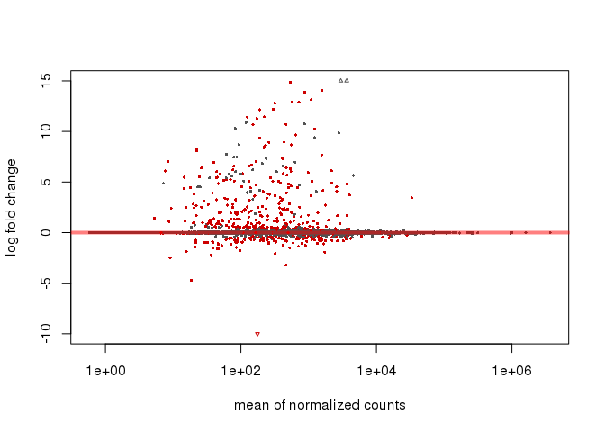

``` r
plotMA(CASEresLFC, ylim=c(-10,15))
```

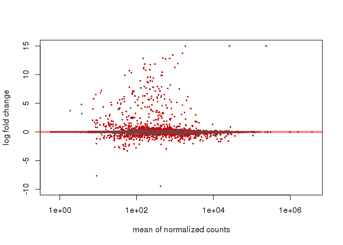 Interesting, the last one (CASE) is thiccc Also a lot are above log two fold

After calling plotMA, one can use the function identify to interactively detect the row number of individual genes by clicking on the plot. One can then recover the gene identifiers by saving the resulting indices:

``` r
plotMA(CAresLFC, ylim=c(-10,15))
```

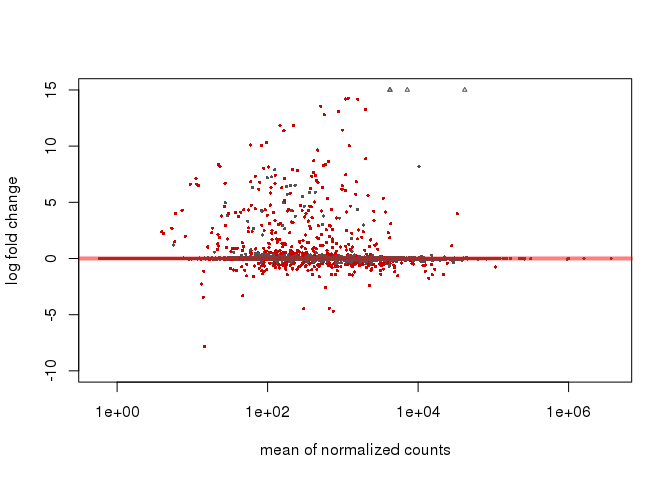

``` r
 plot.new()
idxCA <- identify(CAresLFC$baseMean, CAresLFC$log2FoldChange)
```


``` r
rownames(CAresLFC)[idxCA]
```

    ## character(0)

``` r
idxCA
```

    ## integer(0)

Come back to this one later, although seems important. I think it's just a probelm with the plot.new though

plot "gene" with smallest p value

``` r
plotCounts(CASE_dds, gene=which.min(CAresLFC$padj), intgroup="treatment")
```

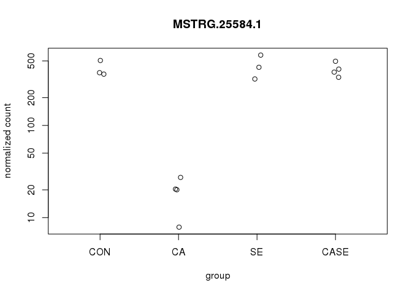

``` r
plotCounts(CASE_dds, gene=which.min(SEresLFC$padj), intgroup="treatment")
```

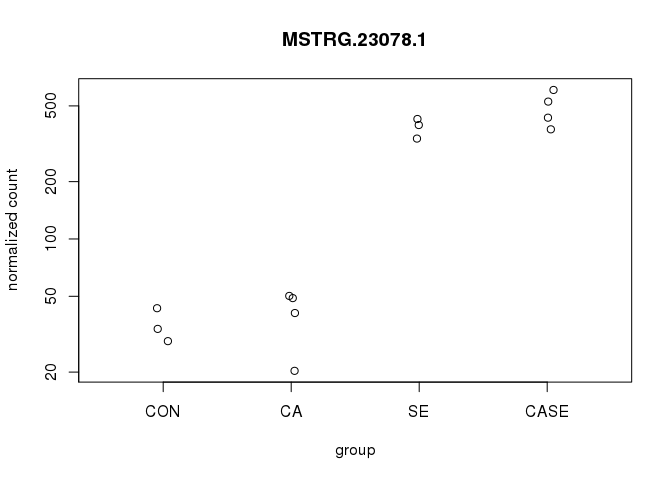

``` r
plotCounts(CASE_dds, gene=which.min(CASEresLFC$padj), intgroup="treatment")
```

 mmmm this is interesting. I don't know why it has all of them for each?? OOh it's the smallest for those comparissons. Because in MSTRG.25584.1 CA is real low but all the others are high. But for SE and CASE, MSTRG.23078.1 both have the smallest adjusted pvalue, they're way up high and CON and CA are down low.

ggplot is much better

``` r
#Coastal Acidifcation lowest adjusted pvalue
minadjpCA <- plotCounts(CASE_dds, gene=which.min(CAresLFC$padj), intgroup="treatment", 
                returnData=TRUE)

ggplot(minadjpCA, aes(x=treatment, y=count)) + 
  geom_point(position=position_jitter(w=0.1,h=0), colour="#9e7bc6") + 
  scale_y_log10(breaks=c(25,100,400)) + ggtitle("MSTRG.25584.1") + ylab("Normalize Read Counts") + xlab("Treatment") 
```

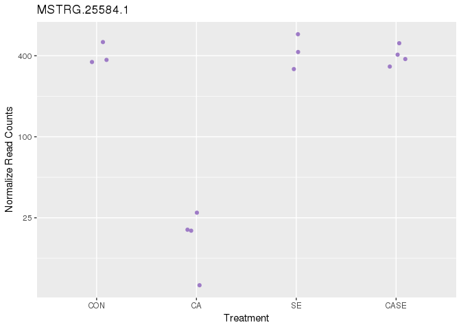

``` r
#Sewage Effluent/Both lowest adjusted pvalue
minadjpSE <- plotCounts(CASE_dds, gene=which.min(SEresLFC$padj), intgroup="treatment", 
                returnData=TRUE)

ggplot(minadjpSE, aes(x=treatment, y=count)) + 
  geom_point(position=position_jitter(w=0.1,h=0), colour="#f2a7ed") + 
  scale_y_log10(breaks=c(25,100,400)) + ggtitle("MSTRG.23078.1") + ylab("Normalize Read Counts") + xlab("Treatment") 
```

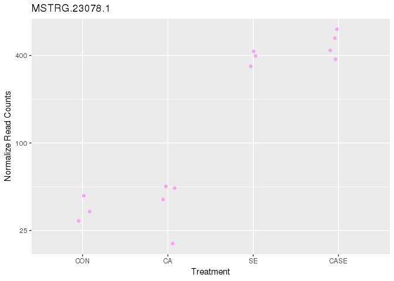

"By adding variables to the design, one can control for additional variation in the counts. For example, if the condition samples are balanced across experimental batches, by including the batch factor to the design, one can increase the sensitivity for finding differences due to condition." ex library or extraction

``` r
# create a copy to do multifactorial design
# coldata(CASE_dds) #can't figure out where that function comes from
CASE_dds_MF <- CASE_dds

levels(CASE_dds_MF$library)
```

    ## [1] "four"  "one"   "three" "two"

``` r
levels(CASE_dds_MF$extraction)
```

    ## [1] "one"   "three" "two"

"We can account for the different libraries, and get a clearer picture of the differences attributable to the treatment. As treatment is the variable of interest, we put it at the end of the formula. Thus the results function will by default pull the condition results unless contrast or name arguments are specified."

``` r
design(CASE_dds_MF) <- formula(~ library + treatment)
CASE_dds_MF_Lib <- DESeq(CASE_dds_MF)
```

    ## using pre-existing size factors

    ## estimating dispersions

    ## found already estimated dispersions, replacing these

    ## gene-wise dispersion estimates

    ## mean-dispersion relationship

    ## final dispersion estimates

    ## fitting model and testing

``` r
results_lib_1_2 <- results(CASE_dds_MF_Lib, contrast=c("library","one","two"))
results_lib_1_3 <- results(CASE_dds_MF_Lib, contrast=c("library","one","three"))
results_lib_1_4 <- results(CASE_dds_MF_Lib, contrast=c("library","one","four"))

head(results_lib_1_2)
```

    ## log2 fold change (MLE): library one vs two 
    ## Wald test p-value: library one vs two 
    ## DataFrame with 6 rows and 6 columns
    ##                       baseMean     log2FoldChange             lfcSE
    ##                      <numeric>          <numeric>         <numeric>
    ## MSTRG.34511.1 138.916499906623 -0.234916031186746 0.204019865328108
    ## MSTRG.30495.2 249.489751447509 -0.188872846092625 0.492465082462035
    ## MSTRG.24752.1 14.3357993160595 -0.583306839493879 0.675321545878476
    ## MSTRG.12668.2 191.323942309777   1.81741609047718  3.65432824338811
    ## MSTRG.22509.1 5.32641467370155   4.30266366985874  3.13656530803931
    ## MSTRG.18250.1  3.3005484993782  -2.01763407229777  2.70802975348623
    ##                             stat            pvalue              padj
    ##                        <numeric>         <numeric>         <numeric>
    ## MSTRG.34511.1  -1.15143704662754 0.249552480239106 0.741121200624486
    ## MSTRG.30495.2 -0.383525356048335 0.701330273482597  0.99242741735433
    ## MSTRG.24752.1 -0.863746822611884 0.387726986003857 0.865103954747345
    ## MSTRG.12668.2  0.497332469726955 0.618954618212475 0.970700110674065
    ## MSTRG.22509.1   1.37177557209812 0.170133314013229 0.624642769303115
    ## MSTRG.18250.1 -0.745056094638671 0.456237809696249 0.906937784944597

``` r
head(results_lib_1_3)
```

    ## log2 fold change (MLE): library one vs three 
    ## Wald test p-value: library one vs three 
    ## DataFrame with 6 rows and 6 columns
    ##                       baseMean     log2FoldChange             lfcSE
    ##                      <numeric>          <numeric>         <numeric>
    ## MSTRG.34511.1 138.916499906623  0.305951123575665 0.170697690561144
    ## MSTRG.30495.2 249.489751447509 -0.506338426572726 0.399997307024675
    ## MSTRG.24752.1 14.3357993160595  0.727578534893353 0.547195862288939
    ## MSTRG.12668.2 191.323942309777  0.596744876928524  2.96625016330279
    ## MSTRG.22509.1 5.32641467370155   20.4597885590905  2.64877384050326
    ## MSTRG.18250.1  3.3005484993782   2.25247498090375  2.39967594736685
    ##                            stat               pvalue                 padj
    ##                       <numeric>            <numeric>            <numeric>
    ## MSTRG.34511.1  1.79235654899544   0.0730758703085235    0.327369375593062
    ## MSTRG.30495.2 -1.26585458871975    0.205565147040569    0.577942484565245
    ## MSTRG.24752.1  1.32964918968844     0.18363388304878    0.546148565067252
    ## MSTRG.12668.2 0.201178202806764    0.840559234693315                    1
    ## MSTRG.22509.1  7.72424895105546 1.12514754359825e-14 1.15654661586162e-12
    ## MSTRG.18250.1 0.938657981455944    0.347906373313167      0.7332300045621

``` r
head(results_lib_1_4)
```

    ## log2 fold change (MLE): library one vs four 
    ## Wald test p-value: library one vs four 
    ## DataFrame with 6 rows and 6 columns
    ##                       baseMean     log2FoldChange             lfcSE
    ##                      <numeric>          <numeric>         <numeric>
    ## MSTRG.34511.1 138.916499906623 -0.190488838935934 0.167140147937168
    ## MSTRG.30495.2 249.489751447509  -0.47250997912728 0.400091211635177
    ## MSTRG.24752.1 14.3357993160595  0.308072234201774  0.53720445451557
    ## MSTRG.12668.2 191.323942309777   2.21643111479487  2.96766008888733
    ## MSTRG.22509.1 5.32641467370155 -0.420285073140416  2.47179451216946
    ## MSTRG.18250.1  3.3005484993782  -3.13968964797829  2.19147049391053
    ##                             stat            pvalue              padj
    ##                        <numeric>         <numeric>         <numeric>
    ## MSTRG.34511.1  -1.13969528737969 0.254413271200377 0.680381717846817
    ## MSTRG.30495.2   -1.1810056441783 0.237600481122198 0.661241412356101
    ## MSTRG.24752.1  0.573472970322968 0.566324495434743 0.912973700711073
    ## MSTRG.12668.2  0.746861516618597 0.455147157714711 0.851281736170949
    ## MSTRG.22509.1 -0.170032367606293 0.864984681603455                 1
    ## MSTRG.18250.1   -1.4326862518581 0.151947520168486 0.535158493668201

Ok but how do I remove these differences?

Transforming count data I think I should do this with the original, but I'm not sure using the regularized log transformation

``` r
rld_CASE_dds <- rlog(CASE_dds, blind=FALSE)
head(assay(rld_CASE_dds), 3)
```

    ##                CASE_J03 CASE_J09 CASE_J12 CASE_J13   CA_J06   CA_J08
    ## MSTRG.34511.1 7.0333486 7.405275 7.175277 7.332408 6.646706 6.860607
    ## MSTRG.30495.2 7.6623885 7.530563 7.944098 7.775839 8.290748 7.945301
    ## MSTRG.24752.1 0.8794409 3.226054 3.700527 3.102276 3.547251 4.186923
    ##                 CA_J11   CA_J18  CON_J02  CON_J05  CON_J10   SE_J01
    ## MSTRG.34511.1 7.080305 7.286132 6.885505 7.146000 7.104426 7.153288
    ## MSTRG.30495.2 8.335724 7.338806 7.762824 7.572935 7.634884 7.624173
    ## MSTRG.24752.1 3.394991 4.232951 4.103194 4.012347 4.220335 4.051309
    ##                 SE_J04   SE_J07
    ## MSTRG.34511.1 7.299466 6.903175
    ## MSTRG.30495.2 8.498528 8.427917
    ## MSTRG.24752.1 3.505573 3.647082

look at what the transformation did

``` r
# this gives log2(n + 1)
CASE_dds_ntd <- normTransform(CASE_dds)
meanSdPlot(assay(CASE_dds_ntd))
```

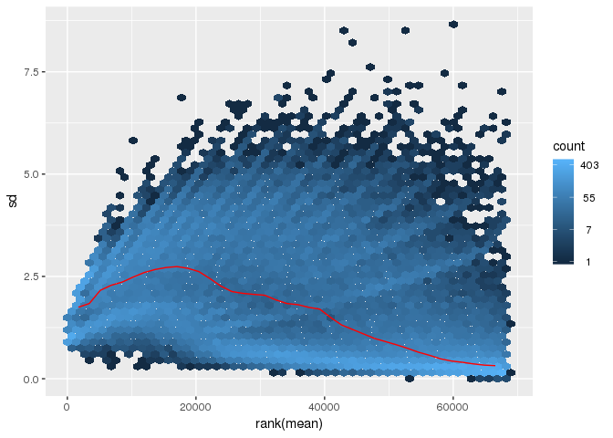

compare that to the regularized log transformation

``` r
meanSdPlot(assay(rld_CASE_dds))
```

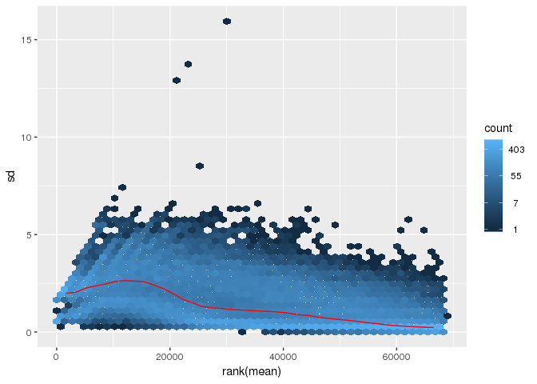 I'm not sure this is any better, some are way out there. what if I try the other transformation? Not sure exactly what I am looking for here

``` r
vsd_CASE_dds <- vst(CASE_dds, blind=FALSE)

meanSdPlot(assay(vsd_CASE_dds))
```

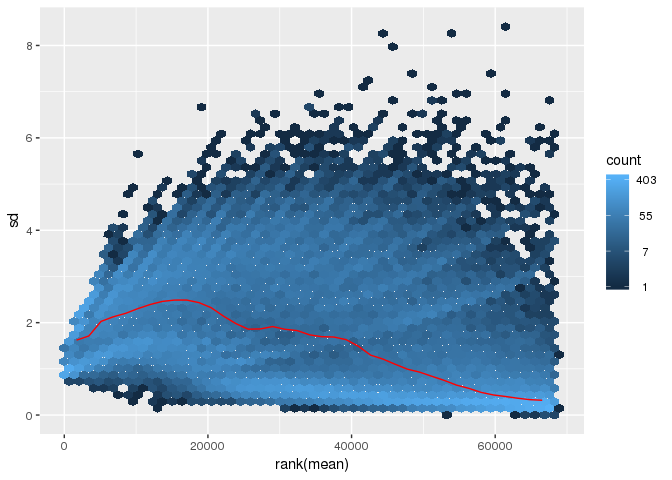 Ok I got no clue

Make a heat map of the count matrix for each transformation type

``` r
#log2(n + 1)

select <- order(rowMeans(counts(CASE_dds,normalized=TRUE)),
                decreasing=TRUE)[1:20]
df <- as.data.frame(colData(CASE_dds)[,c("treatment","library", "extraction")])
pheatmap(assay(CASE_dds_ntd)[select,], cluster_rows=FALSE, show_rownames=FALSE,
         cluster_cols=FALSE, annotation_col=df)
```

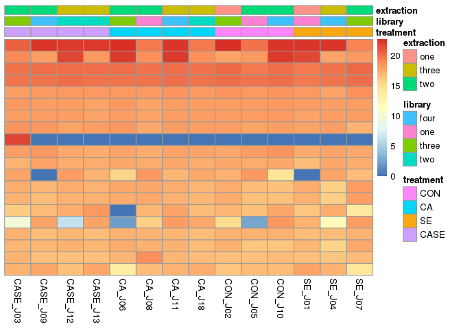

``` r
# vsd
pheatmap(assay(vsd_CASE_dds)[select,], cluster_rows=FALSE, show_rownames=FALSE,
         cluster_cols=FALSE, annotation_col=df)
```

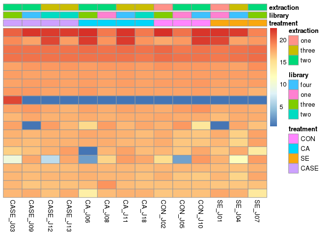

``` r
# rld
pheatmap(assay(rld_CASE_dds)[select,], cluster_rows=FALSE, show_rownames=FALSE,
         cluster_cols=FALSE, annotation_col=df)
```

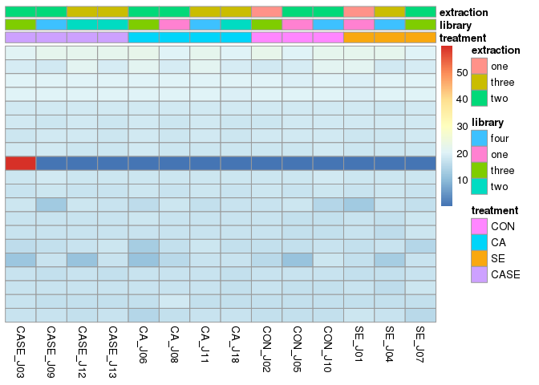 Ok why is this one so different... Also what is up with J03?

I don't know what any of those rows are... this is why I don't like heat maps

Let me try a PCA

``` r
plotPCA(vsd_CASE_dds, intgroup=c("treatment"))
```

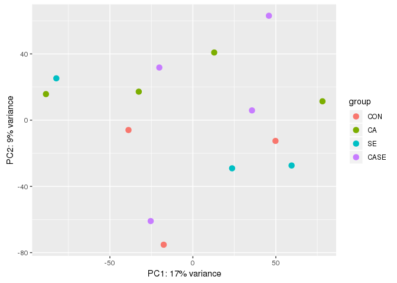 lol

``` r
plotPCA(rld_CASE_dds, intgroup=c("treatment"))
```

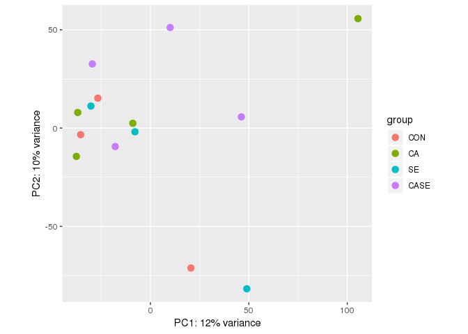

``` r
plotPCA(CASE_dds_ntd, intgroup=c("treatment"))
```

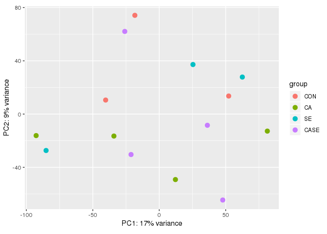 ahhhhhhhhhhhhhhhhhhh ha ha

``` r
sampleDists <- dist(t(assay(CASE_dds_ntd)))
```

``` r
sampleDistMatrix <- as.matrix(sampleDists)
rownames(sampleDistMatrix) <- paste(CASE_dds_ntd$treatment, CASE_dds_ntd$library, sep="-")
colnames(sampleDistMatrix) <- NULL
colors <- colorRampPalette( rev(brewer.pal(9, "Blues")) )(255)
pheatmap(sampleDistMatrix,
         clustering_distance_rows=sampleDists,
         clustering_distance_cols=sampleDists,
         col=colors)
```

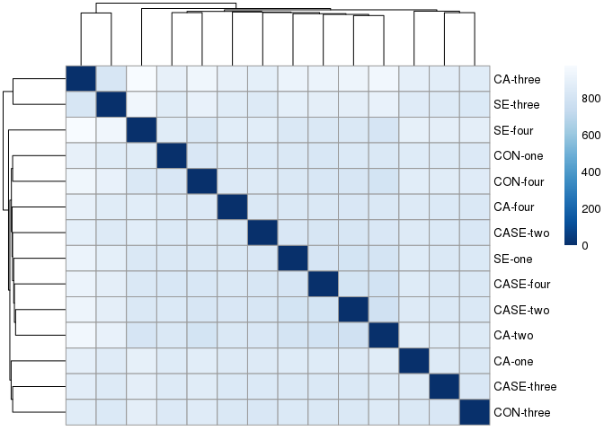
