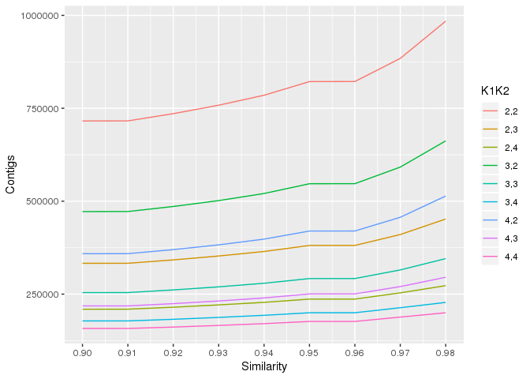
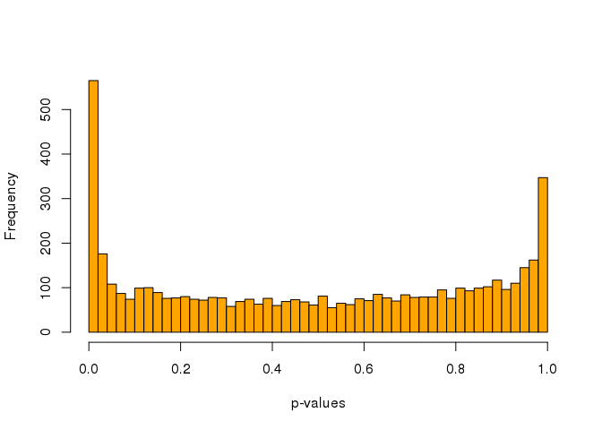

Genetic structure and dispersal of the mountainous star coral along the Caribbean basin
---------------------------------------------------------------------------------------

Create a conda environment and activate it
------------------------------------------

    conda create -n Orbicella ddocent
    conda activate Orbicella

Let´s make a working directory and change to it
-----------------------------------------------

    mkdir Orbicella_Raw
    cd Orbicella_Raw

There are 2 GBS libraries, each one with 95 individuals and a "Blank" sample, for a total of 190 individuals and 2 Blank samples. Let\`s make a directory for each sequencing library
-------------------------------------------------------------------------------------------------------------------------------------------------------------------------------------

    mkdir A_H5FYWBGXY
    mkdir B_HCFMGBGXY

Now we\`re going to symlink all the raw sequncing files to the its correspondent directory in our working directory
-------------------------------------------------------------------------------------------------------------------

    ln -s /RAID_STORAGE2/Shared_Data/Prada_Data/Orbicella/Orbicella_Cornell_raw/CORNELL_DATA_CORAL_ADAPTATION/H5FYWBGXY_1_fastq.gz ./A_H5FYWBGXY

    ln -s /RAID_STORAGE2/Shared_Data/Prada_Data/Orbicella/Orbicella_Cornell_raw/CORNELL_DATA_CORAL_ADAPTATION/HCFMGBGXY_1_fastq.gz ./B_HCFMGBGXY

The sample and barcode files for each library are already included in each directory
------------------------------------------------------------------------------------

    cat A_H5FYWBGXY/barcodes_H5FYWBGXY_rename
    cat B_HCFMGBGXY/barcodes_HCFMGBGXY_rename

Now we need to turn them into a list of barcodes for each library.
------------------------------------------------------------------

    cut -f2 A_H5FYWBGXY/barcodes_H5FYWBGXY_rename > barcodes_H5FYWBGXY
    cut -f2 B_HCFMGBGXY/barcodes_HCFMGBGXY_rename > barcodes_HCFMGBGXY

We are now going to check read quality of each library using FASTQC program
---------------------------------------------------------------------------

    fastqc /RAID_STORAGE2/mgomez/Orbicella_Raw/A_H5FYWBGXY/*.fq.gz
    fastqc /RAID_STORAGE2/mgomez/Orbicella_Raw/B_HCFMGBGXY/*fq.gz

we are now going to aggregate the results from FASTQC analyses across all samples into a single report.
-------------------------------------------------------------------------------------------------------

First install the program MultiQC
---------------------------------

    conda install multiqc
    Proceed ([y]/n)? y

    multiqc /RAID_STORAGE2/mgomez/Orbicella_Raw/A_H5FYWBGXY/ 
    multiqc /RAID_STORAGE2/mgomez/Orbicella_Raw/B_HCFMGBGXY/

Now we copy the multiqc reports for each library to the class repository
------------------------------------------------------------------------

    cp /RAID_STORAGE2/mgomez/Orbicella_Raw/A_H5FYWBGXY/multiqc_report.html /home/mgomez/repos/BIO_594_2019/Final_Assignment/Matias_Final_Project/MultiQC_Reports/A_H5FYWBGXY_RAW_multiqc_report.html

     cp /RAID_STORAGE2/mgomez/Orbicella_Raw/B_HCFMGBGXY/multiqc_report.html /home/mgomez/repos/BIO_594_2019/Final_Assignment/Matias_Final_Project/MultiQC_Reports/B_HCFMGBGXY_RAW_multiqc_report.html

We are now goin to estimate number of reads in our data following the script ReferenceOpt.sh from dDocent
---------------------------------------------------------------------------------------------------------

Create a new folder called RefOpt
---------------------------------

Place a subset of individuals of your total data set
----------------------------------------------------

Less than 5 individuals per region or locality
----------------------------------------------

This only needs to capture the total variability present in your data set
-------------------------------------------------------------------------

Include all .fq.gz files for each individual
--------------------------------------------

Run ReferenceOpt.sh
-------------------

Visualize data in kopt.data
---------------------------

Plot values for each k1,k2 combination across similarity thresholds
-------------------------------------------------------------------

Pick a similarity threshold at the point of inflection on the curve \#\#Here’s some R code to quickly plot this for you:
------------------------------------------------------------------------------------------------------------------------

    mkdir /RAID_STORAGE2/mgomez/Orbicella_Raw/Libraries_A_B/RefOpt
    cd /RAID_STORAGE2/mgomez/Orbicella_Raw/Libraries_A_B/RefOpt
    cp /RAID_STORAGE2/mgomez/Orbicella_Raw/Libraries_A_B/CU_101.F.fq.gz CU_102.F.fq.gz CU_103.F.fq.gz CU_104.F.fq.gz PAN2014_233.F.fq.gz PAN2014_234.F.fq.gz PAN2014_235.F.fq.gz PAN2014_236.F.fq.gz  PR_100.F.fq.gz PR_101.F.fq.gz PR_102.F.fq.gz PR_103.F.fq.gz /RAID_STORAGE2/mgomez/Orbicella_Raw/Libraries_A_B/RefOpt/
    wget https://github.com/jpuritz/dDocent/blob/master/scripts/ReferenceOpt.sh
    ReferenceOpt.sh
    ReferenceOpt.sh 2 4 2 4 SE 20 0.9 0.98 0.01

Visualize data in kopt.data. Plot values for each k1,k2 combination across similarity thresholds. Pick a similarity threshold at the point of inflection on the curve \* Here’s some R code to quickly plot this for you:
-------------------------------------------------------------------------------------------------------------------------------------------------------------------------------------------------------------------------

    library(ggplot2)

    data.table <- read.table("/RAID_STORAGE2/mgomez/Orbicella_Raw/Libraries_A_B/RefOpt/kopt.data", header = FALSE, col.names= c("k1","k2","Similarity", "Contigs"))

    data.table$K1K2 <- paste(data.table$k1, data.table$k2, sep=",")

    df=data.frame(data.table)
    df$K1K2 <- as.factor(df$K1K2)

    p <- ggplot(df, aes(x=Similarity, y=Contigs, group=K1K2)) + scale_x_continuous(breaks=seq(0.8,0.98,0.01)) + geom_line(aes(colour = K1K2))
    p

We can now go ahead and demultiplex the data. This means we are going to separate individuals by barcode.For this task we are going to use process\_radtags from the Stacks package (<http://creskolab.uoregon.edu/stacks/>) process\_radtags takes fastq or fastq.gz files as input along with a file that lists barcodes.
---------------------------------------------------------------------------------------------------------------------------------------------------------------------------------------------------------------------------------------------------------------------------------------------------------------------------

    process_radtags -f A_H5FYWBGXY/H5FYWBGXY_1_fastq.gz -b barcodes_H5FYWBGXY -e apeKI -r -i gzfastq

    process_radtags -f B_HCFMGBGXY/HCFMGBGXY_1_fastq.gz -b barcodes_HCFMGBGXY -e apeKI -r -i gzfastq

The option -e specifies the 5’ restriction site, -i states the format of the input sequences.The -r option tells the program to fix cut sites and barcodes that have up to 1-2 mutations in them. This can be changed with the --barcode\_dist flag.
----------------------------------------------------------------------------------------------------------------------------------------------------------------------------------------------------------------------------------------------------

Now copy the demultiplexed files from dir A\_H5FYWBGXY and B\_HCFMGBGXY to a new dir and change to in
=====================================================================================================

    mkdir Libraries_A_B
    cp A_H5FYWBGXY/*fq.gz .
    cp B_HCFMGBGXY/*fq.gz .
    cd Libraries_A_B

Download O.faveolata genome
---------------------------

    wget ftp://ftp.ncbi.nlm.nih.gov/sra/wgs_aux/MZ/GG/MZGG01/MZGG01.1.fsa_nt.gz

Unzip O.faveolata genome
------------------------

    gunzip MZGG01.1.fsa_nt.gz

rename O.faveolata genome
-------------------------

    mv MZGG01.1.fsa_nt.gz reference.fasta

Running dDocent on demultiplex files in Libraries\_A\_B
=======================================================

    dDocent
    dDocent 2.7.7 

    Contact jpuritz@uri.edu with any problems 

     
    Checking for required software

    All required software is installed!

    dDocent run started Sat Apr 27 13:28:20 EDT 2019 

    190 individuals are detected. Is this correct? Enter yes or no and press [ENTER]
    yes

    Proceeding with 190 individuals
    dDocent detects 80 processors available on this system.
    Please enter the maximum number of processors to use for this analysis.
    20 
    dDocent detects 503 gigabytes of maximum memory available on this system.
    Please enter the maximum memory to use for this analysis in gigabytes
    For example, to limit dDocent to ten gigabytes, enter 10
    This option does not work with all distributions of Linux.  If runs are hanging at variant calling, enter 0
    Then press [ENTER]
    0
    Do you want to quality trim your reads?
    Type yes or no and press [ENTER]?
    yes 

    Do you want to perform an assembly?
    Type yes or no and press [ENTER].
    no

    Do you want to map reads?  Type yes or no and press [ENTER]
    yes

    Please enter your email address.  dDocent will email you when it is finished running.
    Don`t worry; dDocent has no financial need to sell your email address to spammers.
    matias_gomez@uri.edu.co

    At this point, all configuration information has been entered and dDocent may take several hours to run.
    It is recommended that you move this script to a background operation and disable terminal input and output.
    All data and logfiles will still be recorded.
    To do this:
    Press control and Z simultaneously
    Type 'bg' without the quotes and press enter
    Type 'disown -h' again without the quotes and press enter

    Now sit back, relax, and wait for your analysis to finish

    (Orbicella) [mgomez@KITT Libraries_A_B]$^Z
    [1]+  Stopped                 dDocent

    (Orbicella) [mgomez@KITT Libraries_A_B]$ bg
    [1]+ dDocent &
    (Orbicella) [mgomez@KITT Libraries_A_B]$ disown -h

### Now we are going to check read quality of each fastq file after filtering in dDcocent :dDocent takes a minimalistic approach to quality filtering, using the program Trimmomatic. Low quality bases (below quality score of 20) are removed from the beginning and end of reads, and an additional sliding 5bp window that will trim bases when the average quality score drops below 10. Additionally, Illumina adapters are detected and removed.Files that have a .R1.fq and .R2.fq are the filtered FASTQ files.

    fastqc /RAID_STORAGE2/mgomez/Orbicella_Raw/Libraries_A_B/*.R1.fq.gz

we are now going to aggregate the results from FASTQC analyses across all samples into a single report and move it the class repository.
----------------------------------------------------------------------------------------------------------------------------------------

    multiqc multiqc /RAID_STORAGE2/mgomez/Orbicella_Raw/Libraries_A_B/
    cp /RAID_STORAGE2/mgomez/Orbicella_Raw/Libraries_A_B/multiqc_report.html /home/mgomez/repos/BIO_594_2019/Final_Assignment/Matias_Final_Project/MultiQC_Reports/All_Trimmed_Samples_multiqc_report.html

SNP filtering
-------------

First, let´s create a working dir and chang to it, then copy the raw VCF file generetaed by dDocent to start the SNP filetring
------------------------------------------------------------------------------------------------------------------------------

    mkdir SNP_Filtering
    cd SNP_Filtering
    mv /RAID_STORAGE2/mgomez/Orbicella_Raw/Libraries_A_B/TotalRawSNPs.vcf .

we are going to use the program VCFtools (<http://vcftools.sourceforge.net>) to filter our vcf file. To make this file more manageable, let’s start by applying three step filter. We are going to only keep variants that have been successfully genotyped in 50% of individuals, a minimum quality score of 30, and a minor allele count of 3
-----------------------------------------------------------------------------------------------------------------------------------------------------------------------------------------------------------------------------------------------------------------------------------------------------------------------------------------------

    vcftools --gzvcf TotalRawSNPs.vcf --max-missing 0.5 --mac 3 --minQ 30 --recode --recode-INFO-all --out raw.g5mac3
    After filtering, kept 190 out of 190 Individuals
    Outputting VCF file...
    After filtering, kept 286741 out of a possible 1909564 Sites
    Run Time = 225.00 seconds

Those two simple filters got rid of 50% of the data and will make the next filtering steps run much faster.
-----------------------------------------------------------------------------------------------------------

We now have a filtered VCF called raw.g5mac3.recode.vcf. There is also a logfile generated called raw.g5mac3.log The next filter we will apply is a minimum depth for a genotype call and a minimum mean depth
--------------------------------------------------------------------------------------------------------------------------------------------------------------------------------------------------------------

This command will recode genotypes that have less than 3 reads.
---------------------------------------------------------------

    vcftools --vcf raw.g5mac3.recode.vcf --minDP 3 --recode --recode-INFO-all --out raw.g5mac3dp3 

    After filtering, kept 190 out of 190 Individuals
    Outputting VCF file...
    After filtering, kept 286741 out of a possible 286741 Sites
    Run Time = 172.00 seconds

the genotype is based on three reads AND prior information from all reads from all individuals
----------------------------------------------------------------------------------------------

Let\`s run a script to help evaluate the potential errors.
----------------------------------------------------------

    curl -L -O https://github.com/jpuritz/dDocent/raw/master/scripts/ErrorCount.sh
    chmod +x ErrorCount.sh 
    ./ErrorCount.sh raw.g5mac3dp3.recode.vcf 

    This script counts the number of potential genotyping errors due to low read depth
    It report a low range, based on a 50% binomial probability of observing the second allele in a heterozygote and a high range based on a 25% probability.
    Potential genotyping errors from genotypes from only 1 read range from 0 to 0.0
    Potential genotyping errors from genotypes from only 2 reads range from 0 to 0.0
    Potential genotyping errors from genotypes from only 3 reads range from 213354 to 716870.28
    Potential genotyping errors from genotypes from only 4 reads range from 82347 to 416348.328
    Potential genotyping errors from genotypes from only 5 reads range from 33933 to 257351
    190 number of individuals and 286741 equals 54480790 total genotypes
    Total genotypes not counting missing data 33687181
    Total potential error rate is between 0.00978514646269 and 0.0412788950194
    SCORCHED EARTH SCENARIO
    WHAT IF ALL LOW DEPTH HOMOZYGOTE GENOTYPES ARE ERRORS?????
    The total SCORCHED EARTH error rate is 0.12201273238.

The next step is to get rid of individuals that did not sequence well. We can do this by assessing individual levels of missing data.
-------------------------------------------------------------------------------------------------------------------------------------

    vcftools --vcf raw.g5mac3dp3.recode.vcf --missing-indv
    After filtering, kept 190 out of 190 Individuals
    Outputting Individual Missingness
    After filtering, kept 286741 out of a possible 286741 Sites
    Run Time = 11.00 seconds

This will create an output called out.imiss. Let’s examine it.
--------------------------------------------------------------

    cat out.imiss

    INDV    N_DATA  N_GENOTYPES_FILTERED    N_MISS  F_MISS
    CU_101  286741  0       6157    0.0214723
    CU_102  286741  0       5901    0.0205795
    CU_103  286741  0       7084    0.0247052
    CU_104  286741  0       8867    0.0309234
    CU_105  286741  0       157410  0.548962
    CU_106  286741  0       286720  0.999927
    CU_10   286741  0       282069  0.983707
    CU_11   286741  0       252201  0.879543
    CU_12   286741  0       220290  0.768254
    CU_13   286741  0       123839  0.431885
    CU_14   286741  0       286646  0.999669
    CU_15   286741  0       5549    0.019352
    CU_16   286741  0       13933   0.0485909
    CU_17   286741  0       5546    0.0193415
    CU_1    286741  0       206909  0.721588
    CU_20   286741  0       286546  0.99932
    CU_22   286741  0       271762  0.947761
    CU_23   286741  0       6769    0.0236067
    CU_24   286741  0       286333  0.998577
    CU_25   286741  0       5905    0.0205935
    CU_26   286741  0       7578    0.026428
    CU_27   286741  0       51670   0.180197
    CU_28   286741  0       286663  0.999728
    CU_2    286741  0       196792  0.686306
    CU_30   286741  0       5633    0.0196449
    CU_31   286741  0       256709  0.895264
    CU_32   286741  0       259326  0.904391
    CU_33   286741  0       137164  0.478355
    CU_34   286741  0       234483  0.817752
    CU_35   286741  0       224239  0.782026
    CU_37   286741  0       7219    0.025176
    CU_38   286741  0       72091   0.251415
    CU_39   286741  0       49068   0.171123
    CU_3    286741  0       167516  0.584207
    CU_40   286741  0       284575  0.992446
    CU_41   286741  0       11514   0.0401547
    CU_42   286741  0       286735  0.999979
    CU_43   286741  0       7231    0.0252179
    CU_44   286741  0       6740    0.0235055
    CU_45   286741  0       261403  0.911635
    CU_47   286741  0       113064  0.394307
    CU_48   286741  0       15174   0.0529188
    CU_49   286741  0       159653  0.556785
    CU_4    286741  0       239403  0.83491
    CU_50   286741  0       145181  0.506314
    CU_51   286741  0       14824   0.0516982
    CU_52   286741  0       252448  0.880404
    CU_53   286741  0       9749    0.0339993
    CU_54   286741  0       9982    0.0348119
    CU_55   286741  0       284445  0.991993
    CU_56   286741  0       212444  0.740892
    CU_57   286741  0       15605   0.0544219
    CU_58   286741  0       286572  0.999411
    CU_59   286741  0       115566  0.403033
    CU_5    286741  0       15473   0.0539616
    CU_60   286741  0       7906    0.0275719
    CU_61   286741  0       276108  0.962918
    CU_62   286741  0       285184  0.99457
    CU_63   286741  0       281357  0.981223
    CU_64   286741  0       9170    0.0319801
    CU_65   286741  0       286722  0.999934
    CU_67   286741  0       286722  0.999934
    CU_68   286741  0       119081  0.415291
    CU_69   286741  0       272605  0.950701
    CU_6    286741  0       283064  0.987177
    CU_70   286741  0       286535  0.999282
    CU_72   286741  0       229582  0.80066
    CU_73   286741  0       180551  0.629666
    CU_74   286741  0       155600  0.54265
    CU_75   286741  0       136627  0.476482
    CU_76   286741  0       231809  0.808426
    CU_78   286741  0       147825  0.515535
    CU_79   286741  0       13201   0.0460381
    CU_7    286741  0       5409    0.0188637
    CU_80   286741  0       286730  0.999962
    CU_81   286741  0       286712  0.999899
    CU_82   286741  0       286622  0.999585
    CU_83   286741  0       286739  0.999993
    CU_84   286741  0       286715  0.999909
    CU_85   286741  0       192687  0.67199
    CU_86   286741  0       75615   0.263705
    CU_87   286741  0       19222   0.0670361
    CU_89   286741  0       249808  0.871197
    CU_8    286741  0       182574  0.636721
    CU_90   286741  0       8048    0.0280671
    CU_91   286741  0       286695  0.99984
    CU_92   286741  0       242961  0.847319
    CU_93   286741  0       5732    0.0199902
    CU_94   286741  0       268774  0.937341
    CU_95   286741  0       281960  0.983326
    CU_96   286741  0       286741  1
    CU_97   286741  0       145513  0.507472
    CU_98   286741  0       58552   0.204198
    CU_99   286741  0       271147  0.945616
    CU_9    286741  0       5670    0.0197739
    PAN2014_233     286741  0       189222  0.659906
    PAN2014_234     286741  0       286728  0.999955
    PAN2014_235     286741  0       45174   0.157543
    PAN2014_236     286741  0       286732  0.999969
    PAN2014_237     286741  0       286740  0.999997
    PAN2014_238     286741  0       286710  0.999892
    PAN2014_240     286741  0       49582   0.172916
    PAN2014_241     286741  0       286741  1
    PAN2014_242     286741  0       286725  0.999944
    PAN2014_244     286741  0       281653  0.982256
    PAN2014_245     286741  0       286084  0.997709
    PAN2014_246     286741  0       286083  0.997705
    PAN2014_247     286741  0       286702  0.999864
    PAN2014_248     286741  0       286721  0.99993
    PAN2014_250     286741  0       159732  0.55706
    PAN2014_251     286741  0       286741  1
    PR_100  286741  0       194371  0.677863
    PR_101  286741  0       41790   0.145741
    PR_102  286741  0       272834  0.9515
    PR_103  286741  0       5293    0.0184592
    PR_104  286741  0       221388  0.772084
    PR_105  286741  0       10339   0.0360569
    PR_106  286741  0       13498   0.0470738
    PR_107  286741  0       59167   0.206343
    PR_108  286741  0       71665   0.249929
    PR_109  286741  0       23058   0.080414
    PR_110  286741  0       5330    0.0185882
    PR_112  286741  0       36363   0.126815
    PR_113  286741  0       156690  0.546451
    PR_114  286741  0       7663    0.0267245
    PR_115  286741  0       219502  0.765506
    PR_126  286741  0       6416    0.0223756
    PR_127  286741  0       194531  0.678421
    PR_128  286741  0       284522  0.992261
    PR_129  286741  0       281410  0.981408
    PR_130  286741  0       5602    0.0195368
    PR_131  286741  0       6945    0.0242205
    PR_132  286741  0       10979   0.0382889
    PR_133  286741  0       131591  0.458919
    PR_134  286741  0       5898    0.0205691
    PR_135  286741  0       233067  0.812814
    PR_136  286741  0       286486  0.999111
    PR_137  286741  0       5789    0.020189
    PR_138  286741  0       81837   0.285404
    PR_139  286741  0       231918  0.808807
    PR_141  286741  0       286499  0.999156
    PR_142  286741  0       100824  0.35162
    PR_146  286741  0       125933  0.439187
    PR_147  286741  0       10322   0.0359976
    PR_148  286741  0       191559  0.668056
    PR_149  286741  0       7465    0.0260339
    PR_150  286741  0       279033  0.973119
    PR_151  286741  0       138214  0.482017
    PR_152  286741  0       286495  0.999142
    PR_153  286741  0       146535  0.511036
    PR_154  286741  0       68498   0.238885
    PR_155  286741  0       210298  0.733408
    PR_156  286741  0       32159   0.112153
    PR_157  286741  0       116478  0.406213
    PR_64   286741  0       13930   0.0485804
    PR_65   286741  0       62136   0.216697
    PR_66   286741  0       55776   0.194517
    PR_67   286741  0       6988    0.0243704
    PR_68   286741  0       286581  0.999442
    PR_69   286741  0       286304  0.998476
    PR_70   286741  0       286606  0.999529
    PR_71   286741  0       7914    0.0275998
    PR_72   286741  0       7285    0.0254062
    PR_73   286741  0       23125   0.0806477
    PR_74   286741  0       6290    0.0219362
    PR_75   286741  0       5240    0.0182743
    PR_76   286741  0       4686    0.0163423
    PR_77   286741  0       90203   0.31458
    PR_78   286741  0       6621    0.0230905
    PR_79   286741  0       19943   0.0695506
    PR_80   286741  0       12809   0.044671
    PR_81   286741  0       13225   0.0461218
    PR_82   286741  0       4401    0.0153483
    PR_83   286741  0       6949    0.0242344
    PR_84   286741  0       221165  0.771306
    PR_85   286741  0       7583    0.0264455
    PR_86   286741  0       45535   0.158802
    PR_87   286741  0       19400   0.0676569
    PR_88   286741  0       133245  0.464688
    PR_89   286741  0       5679    0.0198053
    PR_90   286741  0       24200   0.0843967
    PR_91   286741  0       104761  0.365351
    PR_92   286741  0       268004  0.934655
    PR_93   286741  0       280432  0.977998
    PR_94   286741  0       6974    0.0243216
    PR_95   286741  0       11982   0.0417868
    PR_96   286741  0       285062  0.994145
    PR_97   286741  0       143123  0.499137
    PR_98   286741  0       276924  0.965764
    PR_99   286741  0       285445  0.99548

We can see that some individuals have as high as 99% missing data. We definitely want to filter those out. Let’s take a look at a histogram
-------------------------------------------------------------------------------------------------------------------------------------------

    mawk '!/IN/' out.imiss | cut -f5 > totalmissing
    gnuplot << \EOF 
    set terminal dumb size 120, 30
    set autoscale 
    unset label
    set title "Histogram of % missing data per individual"
    set ylabel "Number of Occurrences"
    set xlabel "% of missing data"
    #set yr [0:100000]
    binwidth=0.01
    bin(x,width)=width*floor(x/width) + binwidth/2.0
    plot 'totalmissing' using (bin($1,binwidth)):(1.0) smooth freq with boxes
    pause -1
    EOF

                                      Histogram of % missing data per individual

      40 ++--------+---------+---------+---------+---------+----------+---------+---------+---------+---------+--------++
         +         +         +         +         +         +       'totalmissing' using (bin($1,binwidth)):(1.0) ****** +
         |                                                                                                   **         |
      35 ++                                                                                                  **        ++
         |                                                                                                   **         |
         |                                                                                                   **         |
      30 ++                                                                                                  **        ++
         |                                                                                                   **         |
         |                                                                                                   **         |
      25 ++**                                                                                                **        ++
         | **                                                                                                **         |
      20 ++**                                                                                                **        ++
         | **                                                                                                **         |
         | **                                                                                                **         |
      15 ++**                                                                                                **        ++
         | **                                                                                                **         |
         |***                                                                                                **         |
      10 +***                                                                                                **        ++
         |*****                                                                                              **         |
         |*****                                                                                              **         |
       5 +*****                                                                                             ***        ++
         |**********                                          ****           **          ***                ****        |
         +****** * ********************************************  *************************+*********************        +
       0 +******************************************************************************************************-------++
         0        0.1       0.2       0.3       0.4       0.5        0.6       0.7       0.8       0.9        1        1.1
                                                        % of missing data

There a lot of individuals with missing more than 50 % missing data. Now we need to create a list of individuals with more than 50% missing data.
-------------------------------------------------------------------------------------------------------------------------------------------------

    mawk '$5 > 0.5' out.imiss | cut -f1 > lowDP.indv

Now that we have a list of individuals to remove, we can feed that directly into VCFtools for filtering.
--------------------------------------------------------------------------------------------------------

    vcftools --vcf raw.g5mac3dp3.recode.vcf --remove lowDP.indv --recode --recode-INFO-all --out raw.g5mac3dplm

    Excluding individuals in 'exclude' list
    After filtering, kept 95 out of 190 Individuals
    Outputting VCF file...
    After filtering, kept 286741 out of a possible 286741 Sites
    Run Time = 103.00 seconds

Now that we have removed poor coverage individuals, we can restrict the data to variants called in a high percentage of individuals and filter by mean depth of genotypes
-------------------------------------------------------------------------------------------------------------------------------------------------------------------------

    vcftools --vcf raw.g5mac3dplm.recode.vcf --max-missing 0.95 --maf 0.05 --recode --recode-INFO-all --out DP3g95maf05 --min-meanDP 20

    After filtering, kept 95 out of 95 Individuals
    Outputting VCF file...
    After filtering, kept 37241 out of a possible 286741 Sites
    Run Time = 22.00 seconds

Since we have multiple localities being sampled we are also going to want to filter by a population specific call rate.
-----------------------------------------------------------------------------------------------------------------------

First, we need to create file that has two tab separated columns. First with the sample name, second with population assignment.
--------------------------------------------------------------------------------------------------------------------------------

    vcf-query -l DP3g95maf05.recode.vcf > DP3g95maf05.indv
    cut -d "_" -f1 DP3g95maf05.indv > DP3g95maf05.indv.pop
    paste DP3g95maf05.indv DP3g95maf05.indv.pop  > popmap

Then we use a script made By Jon Puritz (dDcocent) for multi-locality studies. It’s called pop\_missing\_filter.sh Executing it with no parameters will give you the usage.
---------------------------------------------------------------------------------------------------------------------------------------------------------------------------

    curl -L -O https://github.com/jpuritz/dDocent/raw/master/scripts/pop_missing_filter.sh
    chmod +x pop_missing_filter.sh
    ./pop_missing_filter.sh

Let´s run the script
--------------------

    pop_missing_filter.sh DP3g95maf05.recode.vcf popmap 0.95 3 DP3g95p5maf05

    After filtering, kept 95 out of 95 Individuals
    Outputting VCF file...
    After filtering, kept 37241 out of a possible 37241 Sites
    Run Time = 13.00 seconds

From this point forward, the filtering steps assume that the vcf file was generated by FreeBayes
------------------------------------------------------------------------------------------------

FreeBayes outputs a lot of information about a locus in the VCF file, using this information and the properties of RADseq, we add some sophisticated filters to the data. Let’s take a look at the header of our VCF file and take a quick look at all the information.
-----------------------------------------------------------------------------------------------------------------------------------------------------------------------------------------------------------------------------------------------------------------------

    mawk '/#/' DP3g95p5maf05.recode.vcf

    ##fileformat=VCFv4.2
    ##fileDate=20190427
    ##source=freeBayes v1.2.0
    ##reference=reference.fasta
    ##contig=<ID=MZGG01001932.1,length=338892>
    ##phasing=none
    ##INFO=<ID=NS,Number=1,Type=Integer,Description="Number of samples with data">
    ##INFO=<ID=DP,Number=1,Type=Integer,Description="Total read depth at the locus">
    ##INFO=<ID=DPB,Number=1,Type=Float,Description="Total read depth per bp at the locus; bases in reads overlapping / bases in haplotype">
    ##INFO=<ID=AC,Number=A,Type=Integer,Description="Total number of alternate alleles in calledgenotypes">
    ##INFO=<ID=AN,Number=1,Type=Integer,Description="Total number of alleles in called genotypes">
    ##INFO=<ID=AF,Number=A,Type=Float,Description="Estimated allele frequency in the range (0,1]">
    ##INFO=<ID=RO,Number=1,Type=Integer,Description="Count of full observations of the referencehaplotype.">
    ##INFO=<ID=AO,Number=A,Type=Integer,Description="Count of full observations of this alternate haplotype.">
    ##INFO=<ID=PRO,Number=1,Type=Float,Description="Reference allele observation count, with partial observations recorded fractionally">
    ##INFO=<ID=PAO,Number=A,Type=Float,Description="Alternate allele observations, with partial observations recorded fractionally">
    ##INFO=<ID=QR,Number=1,Type=Integer,Description="Reference allele quality sum in phred">
    ##INFO=<ID=QA,Number=A,Type=Integer,Description="Alternate allele quality sum in phred">
    ##INFO=<ID=PQR,Number=1,Type=Float,Description="Reference allele quality sum in phred for partial observations">
    ##INFO=<ID=PQA,Number=A,Type=Float,Description="Alternate allele quality sum in phred for partial observations">
    ##INFO=<ID=SRF,Number=1,Type=Integer,Description="Number of reference observations on the forward strand">
    ##INFO=<ID=SRR,Number=1,Type=Integer,Description="Number of reference observations on the reverse strand">
    ##INFO=<ID=SAF,Number=A,Type=Integer,Description="Number of alternate observations on the forward strand">
    ##INFO=<ID=SAR,Number=A,Type=Integer,Description="Number of alternate observations on the reverse strand">
    ##INFO=<ID=SRP,Number=1,Type=Float,Description="Strand balance probability for the referenceallele: Phred-scaled upper-bounds estimate of the probability of observing the deviation between SRF and SRR given E(SRF/SRR) ~ 0.5, derived using Hoeffding's inequality">
    ##INFO=<ID=SAP,Number=A,Type=Float,Description="Strand balance probability for the alternateallele: Phred-scaled upper-bounds estimate of the probability of observing the deviation between SAF and SAR given E(SAF/SAR) ~ 0.5, derived using Hoeffding's inequality">
    ##INFO=<ID=AB,Number=A,Type=Float,Description="Allele balance at heterozygous sites: a number between 0 and 1 representing the ratio of reads showing the reference allele to all reads, considering only reads from individuals called as heterozygous">
    ##INFO=<ID=ABP,Number=A,Type=Float,Description="Allele balance probability at heterozygous sites: Phred-scaled upper-bounds estimate of the probability of observing the deviation between ABR and ABA given E(ABR/ABA) ~ 0.5, derived using Hoeffding's inequality">
    ##INFO=<ID=RUN,Number=A,Type=Integer,Description="Run length: the number of consecutive repeats of the alternate allele in the reference genome">
    ##INFO=<ID=RPP,Number=A,Type=Float,Description="Read Placement Probability: Phred-scaled upper-bounds estimate of the probability of observing the deviation between RPL and RPR given E(RPL/RPR) ~ 0.5, derived using Hoeffding's inequality">
    ##INFO=<ID=RPPR,Number=1,Type=Float,Description="Read Placement Probability for reference observations: Phred-scaled upper-bounds estimate of the probability of observing the deviation between RPL and RPR given E(RPL/RPR) ~ 0.5, derived using Hoeffding's inequality">
    ##INFO=<ID=RPL,Number=A,Type=Float,Description="Reads Placed Left: number of reads supporting the alternate balanced to the left (5') of the alternate allele">
    ##INFO=<ID=RPR,Number=A,Type=Float,Description="Reads Placed Right: number of reads supporting the alternate balanced to the right (3') of the alternate allele">
    ##INFO=<ID=EPP,Number=A,Type=Float,Description="End Placement Probability: Phred-scaled upper-bounds estimate of the probability of observing the deviation between EL and ER given E(EL/ER) ~ 0.5, derived using Hoeffding's inequality">
    ##INFO=<ID=EPPR,Number=1,Type=Float,Description="End Placement Probability for reference observations: Phred-scaled upper-bounds estimate of the probability of observing the deviation between EL and ER given E(EL/ER) ~ 0.5, derived using Hoeffding's inequality">
    ##INFO=<ID=DPRA,Number=A,Type=Float,Description="Alternate allele depth ratio.  Ratio between depth in samples with each called alternate allele and those without.">
    ##INFO=<ID=ODDS,Number=1,Type=Float,Description="The log odds ratio of the best genotype combination to the second-best.">
    ##INFO=<ID=GTI,Number=1,Type=Integer,Description="Number of genotyping iterations required to reach convergence or bailout.">
    ##INFO=<ID=TYPE,Number=A,Type=String,Description="The type of allele, either snp, mnp, ins, del, or complex.">
    ##INFO=<ID=CIGAR,Number=A,Type=String,Description="The extended CIGAR representation of eachalternate allele, with the exception that '=' is replaced by 'M' to ease VCF parsing.  Note that INDEL alleles do not have the first matched base (which is provided by default, per the spec) referred to by the CIGAR.">
    ##INFO=<ID=NUMALT,Number=1,Type=Integer,Description="Number of unique non-reference alleles in called genotypes at this position.">
    ##INFO=<ID=MEANALT,Number=A,Type=Float,Description="Mean number of unique non-reference allele observations per sample with the corresponding alternate alleles.">
    ##INFO=<ID=LEN,Number=A,Type=Integer,Description="allele length">
    ##INFO=<ID=MQM,Number=A,Type=Float,Description="Mean mapping quality of observed alternate alleles">
    ##INFO=<ID=MQMR,Number=1,Type=Float,Description="Mean mapping quality of observed reference alleles">
    ##INFO=<ID=PAIRED,Number=A,Type=Float,Description="Proportion of observed alternate alleles which are supported by properly paired read fragments">
    ##INFO=<ID=PAIREDR,Number=1,Type=Float,Description="Proportion of observed reference alleleswhich are supported by properly paired read fragments">
    ##INFO=<ID=MIN_DP,Number=1,Type=Integer,Description="Minimum depth in gVCF output block.">
    ##INFO=<ID=END,Number=1,Type=Integer,Description="Last position (inclusive) in gVCF output record.">
    ##INFO=<ID=technology.Illumina,Number=A,Type=Float,Description="Fraction of observations supporting the alternate observed in reads from Illumina">
    ##FORMAT=<ID=GT,Number=1,Type=String,Description="Genotype">
    ##FORMAT=<ID=GQ,Number=1,Type=Float,Description="Genotype Quality, the Phred-scaled marginal(or unconditional) probability of the called genotype">
    ##FORMAT=<ID=GL,Number=G,Type=Float,Description="Genotype Likelihood, log10-scaled likelihoods of the data given the called genotype for each possible genotype generated from the reference and alternate alleles given the sample ploidy">
    ##FORMAT=<ID=DP,Number=1,Type=Integer,Description="Read Depth">
    ##FORMAT=<ID=AD,Number=R,Type=Integer,Description="Number of observation for each allele">
    ##FORMAT=<ID=RO,Number=1,Type=Integer,Description="Reference allele observation count">
    ##FORMAT=<ID=QR,Number=1,Type=Integer,Description="Sum of quality of the reference observations">
    ##FORMAT=<ID=AO,Number=A,Type=Integer,Description="Alternate allele observation count">
    ##FORMAT=<ID=QA,Number=A,Type=Integer,Description="Sum of quality of the alternate observations">
    ##FORMAT=<ID=MIN_DP,Number=1,Type=Integer,Description="Minimum depth in gVCF output block.">
    #CHROM  POS     ID      REF     ALT     QUAL    FILTER  INFO    FORMAT  CU_101  CU_102  CU_103       CU_104  CU_13   CU_15   CU_16   CU_17   CU_23   CU_25   CU_26   CU_27   CU_30   CU_3CU_37    CU_38   CU_39   CU_41   CU_43   CU_44   CU_47   CU_48   CU_51   CU_53   CU_54   CU_5CU_59    CU_5    CU_60   CU_64   CU_68   CU_75   CU_79   CU_7    CU_86   CU_87   CU_90   CU_9CU_98    CU_9    PAN2014_235     PAN2014_240     PR_101  PR_103  PR_105  PR_106  PR_107  PR_108       PR_109  PR_110  PR_112  PR_114  PR_126  PR_130  PR_131  PR_132  PR_133  PR_134  PR_137       PR_138  PR_142  PR_146  PR_147  PR_149  PR_151  PR_154  PR_156  PR_157  PR_64   PR_6PR_66    PR_67   PR_71   PR_72   PR_73   PR_74   PR_75   PR_76   PR_77   PR_78   PR_79   PR_8PR_81    PR_82   PR_83   PR_85   PR_86   PR_87   PR_88   PR_89   PR_90   PR_91   PR_94   PR_9PR_97

Let’s use our first filter
--------------------------

    vcffilter -s -f "AB > 0.25 & AB < 0.75 | AB < 0.01" DP3g95p5maf05.recode.vcf > DP3g95p5maf05.fil1.vcf

vcffilter works with simple conditional statements, so this filters out loci with an allele balance below 0.25 and above 0.75. However, it does include those that are close to zero. The last condition is to catch loci that are fixed variants (all individuals are homozygous for one of the two variants). The -s tells the filter to apply to sites, not just alleles To see how many loci are now in the VCF file, you could feed it into VCFtools or you can just use a simple mawk statement
-----------------------------------------------------------------------------------------------------------------------------------------------------------------------------------------------------------------------------------------------------------------------------------------------------------------------------------------------------------------------------------------------------------------------------------------------------------------------------------------------------

    mawk '!/#/' DP3g95p5maf05.recode.vcf | wc -l
    37241

    mawk '!/#/' DP3g95p5maf05.fil1.vcf | wc -l
    30956

The next filter we will apply filters out sites that have reads from both strands. For GWAS and even RNAseq, this can be a good thing. Unless you are using super small genomic fragment or really long reads (MiSeq). A SNP should be covered only by forward or only reverse reads.
-------------------------------------------------------------------------------------------------------------------------------------------------------------------------------------------------------------------------------------------------------------------------------------

    vcffilter -f "SAF / SAR > 100 & SRF / SRR > 100 | SAR / SAF > 100 & SRR / SRF > 100" -s DP3g95p5maf05.fil1.vcf > DP3g95p5maf05.fil2.vcf

The filter is based on proportions, so that a few extraneous reads won’t remove an entire locus. In plain english, it’s keeping loci that have over 100 times more forward alternate reads than reverse alternate reads and 100 times more forward reference reads than reverse reference reads along with the reciprocal.
--------------------------------------------------------------------------------------------------------------------------------------------------------------------------------------------------------------------------------------------------------------------------------------------------------------------------

    mawk '!/#/' DP3g95p5maf05.fil2.vcf | wc -l
    12079

The next filter looks at the ratio of mapping qualities between reference and alternate alleles
-----------------------------------------------------------------------------------------------

    vcffilter -f "MQM / MQMR > 0.9 & MQM / MQMR < 1.05" DP3g95p5maf05.fil2.vcf > DP3g95p5maf05.fil3.vcf

The rationale here is that, again, because RADseq loci and alleles all should start from the same genomic location there should not be large discrepancy between the mapping qualities of two alleles.
------------------------------------------------------------------------------------------------------------------------------------------------------------------------------------------------------

    mawk '!/#/' DP3g95p5maf05.fil3.vcf | wc -l
    8946

Yet another filter that can be applied is whether or not their is a discrepancy in the properly paired status of for reads supporting reference or alternate alleles.
---------------------------------------------------------------------------------------------------------------------------------------------------------------------

    vcffilter -f "PAIRED > 0.05 & PAIREDR > 0.05 & PAIREDR / PAIRED < 1.75 & PAIREDR / PAIRED > 0.25 | PAIRED < 0.05 & PAIREDR < 0.05" -s DP3g95p5maf05.fil3.vcf > DP3g95p5maf05.fil4.vcf

    mawk '!/#/' DP3g95p5maf05.fil4.vcf | wc -l
    8946

The next filter we will apply is to look at the ration of locus quality score to depth Heng Li found some interesting results about how quality score and locus depth are related to each other in real and spurious variant calls In short, with whole genome samples, it was found that high coverage can lead to inflated locus quality scores. Heng proposed that for read depths greater than the mean depth plus 2-3 times the square root of mean depth that the quality score will be twice as large as the depth in real variants and below that value for false variants. implement two filters based on this idea. the first is removing any locus that has a quality score below 1/4 of the depth.(dDocent)
-----------------------------------------------------------------------------------------------------------------------------------------------------------------------------------------------------------------------------------------------------------------------------------------------------------------------------------------------------------------------------------------------------------------------------------------------------------------------------------------------------------------------------------------------------------------------------------------------------------------------------------------------------------------------------------------------------------------------

    vcffilter -f "QUAL / DP > 0.25" DP3g95p5maf05.fil4.vcf > DP3g95p5maf05.fil5.vcf

The second is more complicated. The first step is to create a list of the depth of each locus
---------------------------------------------------------------------------------------------

    cut -f8 DP3g95p5maf05.fil5.vcf | grep -oe "DP=[0-9]*" | sed -s 's/DP=//g' > DP3g95p5maf05.fil5.DEPTH

The second step is to create a list of quality scores.
------------------------------------------------------

    mawk '!/#/' DP3g95p5maf05.fil5.vcf | cut -f1,2,6 > DP3g95p5maf05.fil5.vcf.loci.qual

Next step is to calculate the mean depth
----------------------------------------

    mawk '{ sum += $1; n++ } END { if (n > 0) print sum / n; }' DP3g95p5maf05.fil5.DEPTH
    4385.9

Now the the mean plus 3X the square of the mean
-----------------------------------------------

    python -c "print int(1952+3*(1952**0.5))"
    2084

Next we paste the depth and quality files together and find the loci above the cutoff that do not have quality scores 2 times the depth
---------------------------------------------------------------------------------------------------------------------------------------

    paste DP3g95p5maf05.fil5.vcf.loci.qual DP3g95p5maf05.fil5.DEPTH | mawk -v x=2084 '$4 > x' | mawk '$3 < 2 * $4' > DP3g95p5maf05.fil5.lowQDloci

Now we can remove those sites and recalculate the depth across loci with VCFtools
---------------------------------------------------------------------------------

    vcftools --vcf DP3g95p5maf05.fil5.vcf --site-depth --exclude-positions DP3g95p5maf05.fil5.lowQDloci --out DP3g95p5maf05.fil5

    After filtering, kept 95 out of 95 Individuals
    Outputting Depth for Each Site
    After filtering, kept 6591 out of a possible 8853 Sites
    Run Time = 0.00 seconds

Now let’s take VCFtools output and cut it to only the depth scores
------------------------------------------------------------------

    cut -f3 DP3g95p5maf05.fil5.ldepth > DP3g95p5maf05.fil5.site.depth

Now let’s calculate the average depth by dividing the above file by the number of individuals 95
------------------------------------------------------------------------------------------------

    mawk '!/D/' DP3g95p5maf05.fil5.site.depth | mawk -v x=95 '{print $1/x}' > meandepthpersite

Let’s plot the data as a histogram
----------------------------------

    gnuplot << \EOF 
    set terminal dumb size 120, 30
    set autoscale
    set xrange [10:150] 
    unset label
    set title "Histogram of mean depth per site"
    set ylabel "Number of Occurrences"
    set xlabel "Mean Depth"
    binwidth=1
    bin(x,width)=width*floor(x/width) + binwidth/2.0
    set xtics 5
    plot 'meandepthpersite' using (bin($1,binwidth)):(1.0) smooth freq with boxes
    pause -1
    EOF

        Histogram of mean depth per site

      300 ++--+---+---+---+---+---+---+--+---+---+---+---+---+---+---+---+---+---+---+---+---+--+---+---+---+---+---+--++
          +   +   +   +   +  **   +   +  +   +   +   +   +   + 'meandepthpersite' using (bin($1,binwidth)):(1.0)+****** +
          |                  ****                                                                                       |
          |                ******                                                                                       |
      250 ++               ******                                                                                      ++
          |                *******                                                                                      |
          |                ********                                                                                     |
          |                ********                                                                                     |
      200 ++               ***********                                                                                 ++
          |              **************                                                                                 |
          |              ****************                                                                               |
      150 ++            *****************                                                                              ++
          |            ******************                                                                               |
          |            *******************                                                                              |
          |            *******************                                                                              |
      100 ++           ***********************                                                                         ++
          |          *************************                                                                          |
          |          *************************                                                                          |
          |          *****************************                                                                      |
       50 ++        *******************************                                                                    ++
          |        *************************************                                                                |
          |       ********************************************                                                          |
          +   +   ****************************************************** **  + ****  +  **   +  +   +   +   +   +   +   +
        0 ++--+---*******************************************************************************************************
          10  15  20  25  30  35  40  45 50  55  60  65  70  75  80  85  90  95 100 105 110 115120 125 130 135 140 145 150
                                                            Mean Depth

### Loci that have high mean depth are indicative of either paralogs or multicopy loci. Either way we want to remove them. Here, I’d remove all loci above a mean depth of 102.5. Now we can combine both filters to produce another VCF file

    vcftools --vcf  DP3g95p5maf05.fil5.vcf --recode-INFO-all --out DP3g95p5maf05.FIL --max-meanDP 102.5 --exclude-positions DP3g95p5maf05.fil5.lowQDloci --recode 

    Outputting VCF file...
    After filtering, kept 6438 out of a possible 8853 Sites
    Run Time = 2.00 seconds

### The next filter to apply is HWE. Heng Li also found that HWE is another excellent filter to remove erroneous variant calls. We don’t want to apply it across the board, since population structure will create departures from HWE as well. We need to apply this by population. I’ve included a perl script written by Chris Hollenbeck, one of the PhD student’s in my current lab that will do this for us.

    curl -L -O https://github.com/jpuritz/dDocent/raw/master/scripts/filter_hwe_by_pop.pl
    chmod +x filter_hwe_by_pop.pl

Let’s filter our SNPs by population specific HWE First, we need to convert our variant calls to SNPs To do this we will use another command from vcflib called vcfallelicprimatives
-----------------------------------------------------------------------------------------------------------------------------------------------------------------------------------

    vcfallelicprimitives DP3g95p5maf05.FIL.recode.vcf --keep-info --keep-geno > DP3g95p5maf05.prim.vcf

This will decompose complex variant calls into phased SNP and INDEL genotypes and keep the INFO flags for loci and genotypes. Next, we can feed this VCF file into VCFtools to remove indels.
---------------------------------------------------------------------------------------------------------------------------------------------------------------------------------------------

    vcftools --vcf DP3g95p5maf05.prim.vcf --remove-indels --recode --recode-INFO-all --out SNP.DP3g95p5maf05
    Outputting VCF file...
    After filtering, kept 6776 out of a possible 7029 Sites
    Run Time = 3.00 seconds

We now have 6776 SNP calls in our new VCF. Now, let’s apply the HWE filter
--------------------------------------------------------------------------

    ./filter_hwe_by_pop.pl -v SNP.DP3g95p5maf05.recode.vcf -p popmap -o SNP.DP3g95p5maf05.HWE -h 0.01

    Processing population: CU (40 inds)
    Processing population: PAN2014 (2 inds)
    Processing population: PR (53 inds)
    Outputting results of HWE test for filtered loci to 'filtered.hwe'
    Kept 5092 of a possible 6776 loci (filtered 1684 loci)

Let\`s copy the filtered vcf for outlier loci detection
-------------------------------------------------------

    cp /RAID_STORAGE2/mgomez/Orbicella_Raw/Libraries_A_B/SNP_Filtering/SNP.DP3g95p5maf05.HWE.recode.vcf .

Converting from VCF to other outputs
------------------------------------

Copy a PGDspider configuration file and file to map individuals to population
-----------------------------------------------------------------------------

    cp /home/BIO594/DATA/Week7/example/BSsnp.spid .
    cp /RAID_STORAGE2/mgomez/Orbicella_Raw/Libraries_A_B/SNP_Filtering/popmap .

Now, run PGDspider
------------------

    java -jar /usr/local/bin/PGDSpider2-cli.jar -inputfile SNP.DP3g95p5maf05.HWE.recode.vcf -outputfile SNP.DP3g95p5maf05.HWE_BayesScan -spid BSsnp.spid

Outlier Detection
-----------------

Run BayeScan
------------

    BayeScan2.1_linux64bits SNP.DP3g95p5maf05.HWE_BayesScan -threads 20 -nbp 30 -thin 20 

The fact that BayesCan is not running could be related to having only 2 individuals in one populations. This small number of individuals is not enough to etimate allele frequencies. So, I\`m going to take out those two individuals from the last vcf file I rerun BayeScan.
-------------------------------------------------------------------------------------------------------------------------------------------------------------------------------------------------------------------------------------------------------------------------------

We first make a file with the individuals to want to remove:PAN2014\_235 and PAN2014\_240
-----------------------------------------------------------------------------------------

    nano Remove_PAN 

    PAN2014_235
    PAN2014_240

We now use vcf tools to remove the individuals from the vcf file
----------------------------------------------------------------

    vcftools --vcf SNP.DP3g95p5maf05.HWE.recode.vcf --remove Remove_PAN --recode --recode-INFO-all --out SNP.DP3g95p5maf05.HWE_CU_PR

    VCFtools - 0.1.17
    (C) Adam Auton and Anthony Marcketta 2009

    Parameters as interpreted:
        --vcf SNP.DP3g95p5maf05.HWE.recode.vcf
        --remove Remove_PAN
        --recode-INFO-all
        --out SNP.DP3g95p5maf05.HWE_CU_PR
        --recode

    Warning: Expected at least 2 parts in INFO entry: ID=AF,Number=A,Type=Float,Description="Estimated allele frequency in the range (0,1]">
    Warning: Expected at least 2 parts in INFO entry: ID=PRO,Number=1,Type=Float,Description="Reference allele observation count, with partial observations recorded fractionally">
    Warning: Expected at least 2 parts in INFO entry: ID=PAO,Number=A,Type=Float,Description="Alternate allele observations, with partial observations recorded fractionally">
    Warning: Expected at least 2 parts in INFO entry: ID=SRP,Number=1,Type=Float,Description="Strand balance probability for the reference allele: Phred-scaled upper-bounds estimate of the probability of observing the deviation between SRF and SRR given E(SRF/SRR) ~ 0.5, derived using Hoeffding's inequality">
    Warning: Expected at least 2 parts in INFO entry: ID=SAP,Number=A,Type=Float,Description="Strand balance probability for the alternate allele: Phred-scaled upper-bounds estimate of the probability of observing the deviation between SAF and SAR given E(SAF/SAR) ~ 0.5, derived using Hoeffding's inequality">
    Warning: Expected at least 2 parts in INFO entry: ID=AB,Number=A,Type=Float,Description="Allele balance at heterozygous sites: a number between 0 and 1 representing the ratio of reads showing the reference allele to all reads, considering only reads from individuals called as heterozygous">
    Warning: Expected at least 2 parts in INFO entry: ID=ABP,Number=A,Type=Float,Description="Allele balance probability at heterozygous sites: Phred-scaled upper-bounds estimate of the probability of observing the deviation between ABR and ABA given E(ABR/ABA) ~ 0.5, derived using Hoeffding's inequality">
    Warning: Expected at least 2 parts in INFO entry: ID=RPP,Number=A,Type=Float,Description="Read Placement Probability: Phred-scaled upper-bounds estimate of the probability of observing the deviation between RPL and RPR given E(RPL/RPR) ~ 0.5, derived using Hoeffding's inequality">
    Warning: Expected at least 2 parts in INFO entry: ID=RPPR,Number=1,Type=Float,Description="Read Placement Probability for reference observations: Phred-scaled upper-bounds estimate of the probability of observing the deviation between RPL and RPR given E(RPL/RPR) ~ 0.5, derived using Hoeffding's inequality">
    Warning: Expected at least 2 parts in INFO entry: ID=EPP,Number=A,Type=Float,Description="End Placement Probability: Phred-scaled upper-bounds estimate of the probability of observing the deviation between EL and ER given E(EL/ER) ~ 0.5, derived using Hoeffding's inequality">
    Warning: Expected at least 2 parts in INFO entry: ID=EPPR,Number=1,Type=Float,Description="End Placement Probability for reference observations: Phred-scaled upper-bounds estimate of the probability of observing the deviation between EL and ER given E(EL/ER) ~ 0.5, derived using Hoeffding's inequality">
    Warning: Expected at least 2 parts in INFO entry: ID=TYPE,Number=A,Type=String,Description="The type of allele, either snp, mnp, ins, del, or complex.">
    Warning: Expected at least 2 parts in INFO entry: ID=TYPE,Number=A,Type=String,Description="The type of allele, either snp, mnp, ins, del, or complex.">
    Warning: Expected at least 2 parts in INFO entry: ID=TYPE,Number=A,Type=String,Description="The type of allele, either snp, mnp, ins, del, or complex.">
    Warning: Expected at least 2 parts in INFO entry: ID=TYPE,Number=A,Type=String,Description="The type of allele, either snp, mnp, ins, del, or complex.">
    Warning: Expected at least 2 parts in INFO entry: ID=TYPE,Number=A,Type=String,Description="The type of allele, either snp, mnp, ins, del, or complex.">
    Warning: Expected at least 2 parts in INFO entry: ID=CIGAR,Number=A,Type=String,Description="The extended CIGAR representation of each alternate allele, with the exception that '=' is replaced by 'M' to ease VCF parsing.  Note that INDEL alleles do not have the first matched base (which is provided by default, per the spec) referred to by the CIGAR.">
    Warning: Expected at least 2 parts in FORMAT entry: ID=GQ,Number=1,Type=Float,Description="Genotype Quality, the Phred-scaled marginal (or unconditional) probability of the called genotype">
    Warning: Expected at least 2 parts in FORMAT entry: ID=GL,Number=G,Type=Float,Description="Genotype Likelihood, log10-scaled likelihoods of the data given the called genotype for each possible genotype generated from the reference and alternate alleles given the sample ploidy">
    Excluding individuals in 'exclude' list
    After filtering, kept 93 out of 95 Individuals
    Outputting VCF file...
    After filtering, kept 5092 out of a possible 5092 Sites
    Run Time = 3.00 seconds

We need to make a new file with the populations. We overwrite the last popmap file that contained the PAN2014 population with two individual
--------------------------------------------------------------------------------------------------------------------------------------------

    vcf-query -l SNP.DP3g95p5maf05.HWE_CU_PR.recode.vcf > SNP.DP3g95p5maf05.HWE_CU_PR.indv
    cut -d "_" -f1 SNP.DP3g95p5maf05.HWE_CU_PR.indv > SNP.DP3g95p5maf05.HWE_CU_PR.pop
    paste SNP.DP3g95p5maf05.HWE_CU_PR.indv SNP.DP3g95p5maf05.HWE_CU_PR.pop  > popmap

Now, run PGDspider
------------------

    java -jar /usr/local/bin/PGDSpider2-cli.jar -inputfile SNP.DP3g95p5maf05.HWE_CU_PR.recode.vcf -outputfile SNP.DP3g95p5maf05.HWE_CU_PR_BayesScan -spid BSsnp.spid

    WARN  15:39:26 - PGDSpider configuration file not found! Loading default configuration.
    initialize convert process...
    read input file...
    read input file done.
    write output file...
    write output file done.

Outlier Detection
-----------------

Run BayeScan
------------

It did not run either after haveing taken out the two only individuals from PAN2014 population. The same "Segmentation fault"" error popped out
-----------------------------------------------------------------------------------------------------------------------------------------------

    BayeScan2.1_linux64bits SNP.DP3g95p5maf05.HWE_CU_PR_BayesScan -threads 20 -nbp 30 -thin 20 
    Using 20 threads (80 cpu detected on this machine)
    Pilot runs...
    /tmp/RtmpDSEh8b/chunk-code-422d42e8149f.txt: line 1: 38824 Segmentation fault      BayeScan2.1_linux64bits SNP.DP3g95p5maf05.HWE_CU_PR_BayesScan -threads 20 -nbp 30 -thin 20

Outlier detection with PCAdapt on R
-----------------------------------

we need to limit SNPs to only those with two alleles:
-----------------------------------------------------

    vcftools --vcf SNP.DP3g95p5maf05.HWE.recode.vcf --max-alleles 2 --recode --recode-INFO-all --out SNP.DP3g95p5maf05.HWE_2A

    VCFtools - 0.1.17
    (C) Adam Auton and Anthony Marcketta 2009

    Parameters as interpreted:
        --vcf SNP.DP3g95p5maf05.HWE.recode.vcf
        --recode-INFO-all
        --max-alleles 2
        --out SNP.DP3g95p5maf05.HWE_2A
        --recode

    Warning: Expected at least 2 parts in INFO entry: ID=AF,Number=A,Type=Float,Description="Estimated allele frequency in the range (0,1]">
    Warning: Expected at least 2 parts in INFO entry: ID=PRO,Number=1,Type=Float,Description="Reference allele observation count, with partial observations recorded fractionally">
    Warning: Expected at least 2 parts in INFO entry: ID=PAO,Number=A,Type=Float,Description="Alternate allele observations, with partial observations recorded fractionally">
    Warning: Expected at least 2 parts in INFO entry: ID=SRP,Number=1,Type=Float,Description="Strand balance probability for the reference allele: Phred-scaled upper-bounds estimate of the probability of observing the deviation between SRF and SRR given E(SRF/SRR) ~ 0.5, derived using Hoeffding's inequality">
    Warning: Expected at least 2 parts in INFO entry: ID=SAP,Number=A,Type=Float,Description="Strand balance probability for the alternate allele: Phred-scaled upper-bounds estimate of the probability of observing the deviation between SAF and SAR given E(SAF/SAR) ~ 0.5, derived using Hoeffding's inequality">
    Warning: Expected at least 2 parts in INFO entry: ID=AB,Number=A,Type=Float,Description="Allele balance at heterozygous sites: a number between 0 and 1 representing the ratio of reads showing the reference allele to all reads, considering only reads from individuals called as heterozygous">
    Warning: Expected at least 2 parts in INFO entry: ID=ABP,Number=A,Type=Float,Description="Allele balance probability at heterozygous sites: Phred-scaled upper-bounds estimate of the probability of observing the deviation between ABR and ABA given E(ABR/ABA) ~ 0.5, derived using Hoeffding's inequality">
    Warning: Expected at least 2 parts in INFO entry: ID=RPP,Number=A,Type=Float,Description="Read Placement Probability: Phred-scaled upper-bounds estimate of the probability of observing the deviation between RPL and RPR given E(RPL/RPR) ~ 0.5, derived using Hoeffding's inequality">
    Warning: Expected at least 2 parts in INFO entry: ID=RPPR,Number=1,Type=Float,Description="Read Placement Probability for reference observations: Phred-scaled upper-bounds estimate of the probability of observing the deviation between RPL and RPR given E(RPL/RPR) ~ 0.5, derived using Hoeffding's inequality">
    Warning: Expected at least 2 parts in INFO entry: ID=EPP,Number=A,Type=Float,Description="End Placement Probability: Phred-scaled upper-bounds estimate of the probability of observing the deviation between EL and ER given E(EL/ER) ~ 0.5, derived using Hoeffding's inequality">
    Warning: Expected at least 2 parts in INFO entry: ID=EPPR,Number=1,Type=Float,Description="End Placement Probability for reference observations: Phred-scaled upper-bounds estimate of the probability of observing the deviation between EL and ER given E(EL/ER) ~ 0.5, derived using Hoeffding's inequality">
    Warning: Expected at least 2 parts in INFO entry: ID=TYPE,Number=A,Type=String,Description="The type of allele, either snp, mnp, ins, del, or complex.">
    Warning: Expected at least 2 parts in INFO entry: ID=TYPE,Number=A,Type=String,Description="The type of allele, either snp, mnp, ins, del, or complex.">
    Warning: Expected at least 2 parts in INFO entry: ID=TYPE,Number=A,Type=String,Description="The type of allele, either snp, mnp, ins, del, or complex.">
    Warning: Expected at least 2 parts in INFO entry: ID=TYPE,Number=A,Type=String,Description="The type of allele, either snp, mnp, ins, del, or complex.">
    Warning: Expected at least 2 parts in INFO entry: ID=TYPE,Number=A,Type=String,Description="The type of allele, either snp, mnp, ins, del, or complex.">
    Warning: Expected at least 2 parts in INFO entry: ID=CIGAR,Number=A,Type=String,Description="The extended CIGAR representation of each alternate allele, with the exception that '=' is replaced by 'M' to ease VCF parsing.  Note that INDEL alleles do not have the first matched base (which is provided by default, per the spec) referred to by the CIGAR.">
    Warning: Expected at least 2 parts in FORMAT entry: ID=GQ,Number=1,Type=Float,Description="Genotype Quality, the Phred-scaled marginal (or unconditional) probability of the called genotype">
    Warning: Expected at least 2 parts in FORMAT entry: ID=GL,Number=G,Type=Float,Description="Genotype Likelihood, log10-scaled likelihoods of the data given the called genotype for each possible genotype generated from the reference and alternate alleles given the sample ploidy">
    After filtering, kept 95 out of 95 Individuals
    Outputting VCF file...
    After filtering, kept 5030 out of a possible 5092 Sites
    Run Time = 2.00 seconds

We are goint to use PCAadapat to detect outlier loci
----------------------------------------------------

We first load the library pcadapt on r (<https://cran.r-project.org/web/packages/pcadapt/vignettes/pcadapt.html>)
-----------------------------------------------------------------------------------------------------------------

    library(pcadapt)

Following the tutorial available on (<https://cran.r-project.org/web/packages/pcadapt/vignettes/pcadapt.html>):
---------------------------------------------------------------------------------------------------------------

The pcadapt function performs two successive tasks. First, PCA is performed on the centered and scaled genotype matrix. The second stage consists in computing test statistics and p-values based on the correlations between SNPs and the first K principal components (PCs). To run the function pcadapt, the user should specify the output returned by the function read.pcadapt and the number K of principal components to compute.
-----------------------------------------------------------------------------------------------------------------------------------------------------------------------------------------------------------------------------------------------------------------------------------------------------------------------------------------------------------------------------------------------------------------------------------------

To choose K, principal component analysis should first be performed with a large enough number of principal components (e.g. K=20).
-----------------------------------------------------------------------------------------------------------------------------------

    filename <- read.pcadapt("SNP.DP3g95p5maf05.HWE_2A.recode.vcf", type = "vcf")

    ## 1517 variant(s) have been discarded as they are not SNPs.
    ## Summary:
    ## 
    ##  - input file:               SNP.DP3g95p5maf05.HWE_2A.recode.vcf
    ##  - output file:              /tmp/RtmprJxj9H/file12a5b587f2aa3.pcadapt
    ## 
    ##  - number of individuals detected:   95
    ##  - number of loci detected:      5030
    ## 
    ## 3513 lines detected.
    ## 95 columns detected.

    x <- pcadapt(input = filename, K=20)

Since PCAdapt discarded 1517 variants beacuse they were not SNPs, I'm going to check out the allele frequency of all my SNPs to make sure the are not fixed alleles that might be beings discarded by PCAdapt
-------------------------------------------------------------------------------------------------------------------------------------------------------------------------------------------------------------

We first make a file with the frequencies of each allele
--------------------------------------------------------

    vcftools --vcf SNP.DP3g95p5maf05.HWE_2A.recode.vcf --freq --out SNP.DP3g95p5maf05.HWE_2A.recode.vcf

    VCFtools - 0.1.17
    (C) Adam Auton and Anthony Marcketta 2009

    Parameters as interpreted:
        --vcf SNP.DP3g95p5maf05.HWE_2A.recode.vcf
        --freq
        --out SNP.DP3g95p5maf05.HWE_2A.recode.vcf

    Warning: Expected at least 2 parts in INFO entry: ID=AF,Number=A,Type=Float,Description="Estimated allele frequency in the range (0,1]">
    Warning: Expected at least 2 parts in INFO entry: ID=PRO,Number=1,Type=Float,Description="Reference allele observation count, with partial observations recorded fractionally">
    Warning: Expected at least 2 parts in INFO entry: ID=PAO,Number=A,Type=Float,Description="Alternate allele observations, with partial observations recorded fractionally">
    Warning: Expected at least 2 parts in INFO entry: ID=SRP,Number=1,Type=Float,Description="Strand balance probability for the reference allele: Phred-scaled upper-bounds estimate of the probability of observing the deviation between SRF and SRR given E(SRF/SRR) ~ 0.5, derived using Hoeffding's inequality">
    Warning: Expected at least 2 parts in INFO entry: ID=SAP,Number=A,Type=Float,Description="Strand balance probability for the alternate allele: Phred-scaled upper-bounds estimate of the probability of observing the deviation between SAF and SAR given E(SAF/SAR) ~ 0.5, derived using Hoeffding's inequality">
    Warning: Expected at least 2 parts in INFO entry: ID=AB,Number=A,Type=Float,Description="Allele balance at heterozygous sites: a number between 0 and 1 representing the ratio of reads showing the reference allele to all reads, considering only reads from individuals called as heterozygous">
    Warning: Expected at least 2 parts in INFO entry: ID=ABP,Number=A,Type=Float,Description="Allele balance probability at heterozygous sites: Phred-scaled upper-bounds estimate of the probability of observing the deviation between ABR and ABA given E(ABR/ABA) ~ 0.5, derived using Hoeffding's inequality">
    Warning: Expected at least 2 parts in INFO entry: ID=RPP,Number=A,Type=Float,Description="Read Placement Probability: Phred-scaled upper-bounds estimate of the probability of observing the deviation between RPL and RPR given E(RPL/RPR) ~ 0.5, derived using Hoeffding's inequality">
    Warning: Expected at least 2 parts in INFO entry: ID=RPPR,Number=1,Type=Float,Description="Read Placement Probability for reference observations: Phred-scaled upper-bounds estimate of the probability of observing the deviation between RPL and RPR given E(RPL/RPR) ~ 0.5, derived using Hoeffding's inequality">
    Warning: Expected at least 2 parts in INFO entry: ID=EPP,Number=A,Type=Float,Description="End Placement Probability: Phred-scaled upper-bounds estimate of the probability of observing the deviation between EL and ER given E(EL/ER) ~ 0.5, derived using Hoeffding's inequality">
    Warning: Expected at least 2 parts in INFO entry: ID=EPPR,Number=1,Type=Float,Description="End Placement Probability for reference observations: Phred-scaled upper-bounds estimate of the probability of observing the deviation between EL and ER given E(EL/ER) ~ 0.5, derived using Hoeffding's inequality">
    Warning: Expected at least 2 parts in INFO entry: ID=TYPE,Number=A,Type=String,Description="The type of allele, either snp, mnp, ins, del, or complex.">
    Warning: Expected at least 2 parts in INFO entry: ID=TYPE,Number=A,Type=String,Description="The type of allele, either snp, mnp, ins, del, or complex.">
    Warning: Expected at least 2 parts in INFO entry: ID=TYPE,Number=A,Type=String,Description="The type of allele, either snp, mnp, ins, del, or complex.">
    Warning: Expected at least 2 parts in INFO entry: ID=TYPE,Number=A,Type=String,Description="The type of allele, either snp, mnp, ins, del, or complex.">
    Warning: Expected at least 2 parts in INFO entry: ID=TYPE,Number=A,Type=String,Description="The type of allele, either snp, mnp, ins, del, or complex.">
    Warning: Expected at least 2 parts in INFO entry: ID=CIGAR,Number=A,Type=String,Description="The extended CIGAR representation of each alternate allele, with the exception that '=' is replaced by 'M' to ease VCF parsing.  Note that INDEL alleles do not have the first matched base (which is provided by default, per the spec) referred to by the CIGAR.">
    Warning: Expected at least 2 parts in FORMAT entry: ID=GQ,Number=1,Type=Float,Description="Genotype Quality, the Phred-scaled marginal (or unconditional) probability of the called genotype">
    Warning: Expected at least 2 parts in FORMAT entry: ID=GL,Number=G,Type=Float,Description="Genotype Likelihood, log10-scaled likelihoods of the data given the called genotype for each possible genotype generated from the reference and alternate alleles given the sample ploidy">
    After filtering, kept 95 out of 95 Individuals
    Outputting Frequency Statistics...
    After filtering, kept 5030 out of a possible 5030 Sites
    Run Time = 0.00 seconds

We then use the next next command line to see if there are any 1 numbers
------------------------------------------------------------------------

    cut -f5 SNP.DP3g95p5maf05.HWE_2A.recode.vcf.frq | grep 1 

There does not seem to be any fixed allele so this is not the cause of the problem. Beacuase we do not know what the variants taken out are we cannot rely filter the vcf file for the identified oulier loci. I\`m going to continue here running PCAdapt fot the exercise sake.
---------------------------------------------------------------------------------------------------------------------------------------------------------------------------------------------------------------------------------------------------------------------------------

The ‘scree plot’ displays in decreasing order the percentage of variance explained by each PC. Up to a constant, it corresponds to the eigenvalues in decreasing order. The ideal pattern in a scree plot is a steep curve followed by a bend and a straight line. The eigenvalues that correspond to random variation lie on a straight line whereas the ones that correspond to population structure lie on a steep curve. We recommend to keep PCs that correspond to eigenvalues to the left of the straight line (Cattell’s rule). In the provided example, K = 2 is the optimal choice for K. The plot function displays a scree plot:
--------------------------------------------------------------------------------------------------------------------------------------------------------------------------------------------------------------------------------------------------------------------------------------------------------------------------------------------------------------------------------------------------------------------------------------------------------------------------------------------------------------------------------------------------------------------------------------------------------------------------------------------

    plot(x, option= "screeplot")

Counting individuals in each population
---------------------------------------

    grep CU popmap | wc -l
    grep PAN2014 popmap | wc -l
    grep PR popmap | wc -l

    ## 0
    ## 0
    ## 0

Since we modifiy the pomap file to eliminate those 2 individuals from PAN2014 population, there are no individuals assigned to tha population. But we know from all previous analyses that those 2 individuals are included in the vcf SNP.DP3g95p5maf05.HWE\_2A.recode.vcf
===========================================================================================================================================================================================================================================================================

When population labels are known, individuals of the same populations can be displayed with the same color using the pop argument, which should contain the list of indices of the populations of origin.
---------------------------------------------------------------------------------------------------------------------------------------------------------------------------------------------------------

    poplist.names <- c(rep("CU",40), rep("PAN2014",2),rep("PR",53))
    plot(x, option= "scores", pop=poplist.names)

    plot(x, option = "scores", i = 3, j = 4, pop = poplist.names)

A Manhattan plot displays −log10 of the p-values.
-------------------------------------------------

    plot(x, option = "manhattan")

    plot(x, option = "qqplot", threshold =0.1)

    plot(x, option = "stat.distribution")

    library(qvalue)
    qval <-qvalue(x$pvalues)$qvalues
    alpha <- 0.1
    outliers <- which(qval < alpha)
    length(outliers)

    ## [1] 337

    outliers

    ##   [1]   25   37   39   40   43   44   45   46   61   66   67   69   70   71
    ##  [15]  121  123  149  159  175  176  189  190  191  203  204  205  206  218
    ##  [29]  220  227  251  269  290  305  324  351  353  366  370  371  393  399
    ##  [43]  400  413  427  437  438  450  456  457  461  464  473  478  488  490
    ##  [57]  495  509  514  552  555  591  598  604  606  644  646  666  667  668
    ##  [71]  670  675  680  681  692  698  699  703  715  741  759  769  770  777
    ##  [85]  812  813  828  832  837  856  857  863  864  873  881  883  886  887
    ##  [99]  891  892  893  948  968  972  994  995 1005 1015 1075 1087 1090 1100
    ## [113] 1106 1107 1115 1122 1124 1125 1128 1139 1146 1149 1151 1170 1171 1172
    ## [127] 1176 1209 1216 1218 1230 1238 1239 1241 1244 1257 1267 1277 1281 1282
    ## [141] 1283 1285 1286 1311 1360 1362 1364 1387 1400 1405 1406 1410 1415 1416
    ## [155] 1424 1425 1442 1443 1444 1446 1452 1454 1483 1514 1516 1517 1532 1558
    ## [169] 1560 1564 1617 1618 1619 1642 1651 1665 1666 1676 1691 1738 1758 1763
    ## [183] 1765 1766 1767 1776 1793 1823 1845 1846 1847 1880 1883 1884 1887 1899
    ## [197] 1910 1945 1946 1968 2015 2017 2022 2031 2036 2039 2092 2097 2120 2144
    ## [211] 2145 2159 2200 2265 2338 2410 2427 2440 2441 2442 2446 2454 2455 2456
    ## [225] 2457 2470 2472 2498 2500 2506 2527 2556 2558 2566 2587 2589 2590 2617
    ## [239] 2619 2635 2641 2643 2647 2649 2650 2651 2714 2754 2755 2756 2764 2765
    ## [253] 2767 2774 2775 2776 2777 2778 2780 2781 2803 2818 2819 2820 2821 2828
    ## [267] 2853 2854 2855 2861 2881 2887 2903 2909 2910 2911 2926 2937 2944 2950
    ## [281] 2958 2978 2979 2985 2994 2996 3036 3038 3046 3058 3061 3068 3071 3073
    ## [295] 3090 3092 3094 3098 3129 3136 3137 3138 3187 3214 3215 3222 3224 3227
    ## [309] 3249 3260 3267 3281 3308 3309 3341 3357 3369 3371 3382 3402 3406 3410
    ## [323] 3411 3412 3413 3414 3415 3417 3422 3429 3432 3435 3442 3492 3494 3496
    ## [337] 3504

    hist(x$pvalues, xlab = "p-values", main = NULL, breaks = 50, col = "orange")

Because we do not know what the variants taken out are we cannot really filter the vcf file for the identified oulier loci.
---------------------------------------------------------------------------------------------------------------------------

Right now I\`m going to run PCAdapt with the vcf file that we created before taking out the 2 individuals from PAN population to see if this might be the cause of the problem.
-------------------------------------------------------------------------------------------------------------------------------------------------------------------------------

    filename2 <- read.pcadapt("SNP.DP3g95p5maf05.HWE_CU_PR.recode.vcf", type = "vcf")

    ## 1579 variant(s) have been discarded as they are not SNPs.
    ## Summary:
    ## 
    ##  - input file:               SNP.DP3g95p5maf05.HWE_CU_PR.recode.vcf
    ##  - output file:              /tmp/RtmprJxj9H/file12a5b7c34adf4.pcadapt
    ## 
    ##  - number of individuals detected:   93
    ##  - number of loci detected:      5092
    ## 
    ## 3513 lines detected.
    ## 93 columns detected.

This is not the problem either. I\`m going to try to filter those outlier loci in the three populations vcf file as an excercise. In the future I will need to solve all these problems encountered so far to have a real vcf file with neutral SNPs only.
----------------------------------------------------------------------------------------------------------------------------------------------------------------------------------------------------------------------------------------------------------

First, we write the oulier to a text file
-----------------------------------------

    write.table(outliers, file ="outliers.txt", row.names = FALSE, col.names = FALSE)

Next, we make a file with all the loci in the vcf but ignoring the headres and extracting only the 1st and second columnd that have the CHROM and ID labels. Additionally we add a column of numbers to every loci
------------------------------------------------------------------------------------------------------------------------------------------------------------------------------------------------------------------

    paste <(seq 1 5030) <(mawk '!/#/' SNP.DP3g95p5maf05.HWE_2A.recode.vcf | cut -f1,2) > SNP.DP3g95p5maf05.HWE_2A.loci

We now compare the files outliers.txt and SNP.DP3g95p5maf05.HWE\_2A.loci to have only those loci commun in each loci position and extract the fields 2 and 3 to make a new file that we will use the vcf file.
--------------------------------------------------------------------------------------------------------------------------------------------------------------------------------------------------------------

Note that these loci are not the ones that really correspond to those detected by PCAdapt becuase this many variants were discarded by it. I\`m showing a way to get rid of those loci assuming they were the ones that really corresponded to the vcf.
-------------------------------------------------------------------------------------------------------------------------------------------------------------------------------------------------------------------------------------------------------

Helpful link: <https://askubuntu.com/questions/879754/awk-comparing-2-columns-of-2-files-and-print-common-lines>
----------------------------------------------------------------------------------------------------------------

    awk 'FNR==NR{a[$1];next}($1 in a){print}' outliers.txt SNP.DP3g95p5maf05.HWE_2A.loci |cut -f2,3 > PCAadapt_outlier_loci 

Now we can continue to remove those outlier loci from the vcf using vcftools
----------------------------------------------------------------------------

    vcftools --vcf SNP.DP3g95p5maf05.HWE_2A.recode.vcf --exclude-positions PCAadapt_outlier_loci  --recode --recode-INFO-all --out SNP.DP3g95p5maf05.HWE_2A_Neutral_PCA

    VCFtools - 0.1.17
    (C) Adam Auton and Anthony Marcketta 2009

    Parameters as interpreted:
        --vcf SNP.DP3g95p5maf05.HWE_2A.recode.vcf
        --exclude-positions PCAadapt_outlier_loci
        --recode-INFO-all
        --out SNP.DP3g95p5maf05.HWE_2A_Neutral_PCA
        --recode

    Warning: Expected at least 2 parts in INFO entry: ID=AF,Number=A,Type=Float,Description="Estimated allele frequency in the range (0,1]">
    Warning: Expected at least 2 parts in INFO entry: ID=PRO,Number=1,Type=Float,Description="Reference allele observation count, with partial observations recorded fractionally">
    Warning: Expected at least 2 parts in INFO entry: ID=PAO,Number=A,Type=Float,Description="Alternate allele observations, with partial observations recorded fractionally">
    Warning: Expected at least 2 parts in INFO entry: ID=SRP,Number=1,Type=Float,Description="Strand balance probability for the reference allele: Phred-scaled upper-bounds estimate of the probability of observing the deviation between SRF and SRR given E(SRF/SRR) ~ 0.5, derived using Hoeffding's inequality">
    Warning: Expected at least 2 parts in INFO entry: ID=SAP,Number=A,Type=Float,Description="Strand balance probability for the alternate allele: Phred-scaled upper-bounds estimate of the probability of observing the deviation between SAF and SAR given E(SAF/SAR) ~ 0.5, derived using Hoeffding's inequality">
    Warning: Expected at least 2 parts in INFO entry: ID=AB,Number=A,Type=Float,Description="Allele balance at heterozygous sites: a number between 0 and 1 representing the ratio of reads showing the reference allele to all reads, considering only reads from individuals called as heterozygous">
    Warning: Expected at least 2 parts in INFO entry: ID=ABP,Number=A,Type=Float,Description="Allele balance probability at heterozygous sites: Phred-scaled upper-bounds estimate of the probability of observing the deviation between ABR and ABA given E(ABR/ABA) ~ 0.5, derived using Hoeffding's inequality">
    Warning: Expected at least 2 parts in INFO entry: ID=RPP,Number=A,Type=Float,Description="Read Placement Probability: Phred-scaled upper-bounds estimate of the probability of observing the deviation between RPL and RPR given E(RPL/RPR) ~ 0.5, derived using Hoeffding's inequality">
    Warning: Expected at least 2 parts in INFO entry: ID=RPPR,Number=1,Type=Float,Description="Read Placement Probability for reference observations: Phred-scaled upper-bounds estimate of the probability of observing the deviation between RPL and RPR given E(RPL/RPR) ~ 0.5, derived using Hoeffding's inequality">
    Warning: Expected at least 2 parts in INFO entry: ID=EPP,Number=A,Type=Float,Description="End Placement Probability: Phred-scaled upper-bounds estimate of the probability of observing the deviation between EL and ER given E(EL/ER) ~ 0.5, derived using Hoeffding's inequality">
    Warning: Expected at least 2 parts in INFO entry: ID=EPPR,Number=1,Type=Float,Description="End Placement Probability for reference observations: Phred-scaled upper-bounds estimate of the probability of observing the deviation between EL and ER given E(EL/ER) ~ 0.5, derived using Hoeffding's inequality">
    Warning: Expected at least 2 parts in INFO entry: ID=TYPE,Number=A,Type=String,Description="The type of allele, either snp, mnp, ins, del, or complex.">
    Warning: Expected at least 2 parts in INFO entry: ID=TYPE,Number=A,Type=String,Description="The type of allele, either snp, mnp, ins, del, or complex.">
    Warning: Expected at least 2 parts in INFO entry: ID=TYPE,Number=A,Type=String,Description="The type of allele, either snp, mnp, ins, del, or complex.">
    Warning: Expected at least 2 parts in INFO entry: ID=TYPE,Number=A,Type=String,Description="The type of allele, either snp, mnp, ins, del, or complex.">
    Warning: Expected at least 2 parts in INFO entry: ID=TYPE,Number=A,Type=String,Description="The type of allele, either snp, mnp, ins, del, or complex.">
    Warning: Expected at least 2 parts in INFO entry: ID=CIGAR,Number=A,Type=String,Description="The extended CIGAR representation of each alternate allele, with the exception that '=' is replaced by 'M' to ease VCF parsing.  Note that INDEL alleles do not have the first matched base (which is provided by default, per the spec) referred to by the CIGAR.">
    Warning: Expected at least 2 parts in FORMAT entry: ID=GQ,Number=1,Type=Float,Description="Genotype Quality, the Phred-scaled marginal (or unconditional) probability of the called genotype">
    Warning: Expected at least 2 parts in FORMAT entry: ID=GL,Number=G,Type=Float,Description="Genotype Likelihood, log10-scaled likelihoods of the data given the called genotype for each possible genotype generated from the reference and alternate alleles given the sample ploidy">
    After filtering, kept 95 out of 95 Individuals
    Outputting VCF file...
    After filtering, kept 4693 out of a possible 5030 Sites
    Run Time = 1.00 seconds

We can now run population analysis with a vcf supposedly composed of only neutral loci (detected by PCAdapt).Ideally, I meant to detect loci outlier loci through BayesScan and PCAdapt. Jus bear in mind that multiple approaches to detect those putatively adaptive loci are needed to conduct population genomic analysis.
------------------------------------------------------------------------------------------------------------------------------------------------------------------------------------------------------------------------------------------------------------------------------------------------------------------------------

We start by loading the following R packages
--------------------------------------------

    library(adegenet)

    ## Loading required package: ade4

    ## 
    ##    /// adegenet 2.1.1 is loaded ////////////
    ## 
    ##    > overview: '?adegenet'
    ##    > tutorials/doc/questions: 'adegenetWeb()' 
    ##    > bug reports/feature requests: adegenetIssues()

    library(vcfR)

    ## 
    ##    *****       ***   vcfR   ***       *****
    ##    This is vcfR 1.8.0.9000 
    ##      browseVignettes('vcfR') # Documentation
    ##      citation('vcfR') # Citation
    ##    *****       *****      *****       *****

We load our last vcf to a vcfR object and then to a genind object
-----------------------------------------------------------------

    my_vcf <- read.vcfR("SNP.DP3g95p5maf05.HWE_2A_Neutral_PCA.recode.vcf")

    ## Scanning file to determine attributes.
    ## File attributes:
    ##   meta lines: 65
    ##   header_line: 66
    ##   variant count: 4693
    ##   column count: 104
    ## 
    Meta line 65 read in.
    ## All meta lines processed.
    ## gt matrix initialized.
    ## Character matrix gt created.
    ##   Character matrix gt rows: 4693
    ##   Character matrix gt cols: 104
    ##   skip: 0
    ##   nrows: 4693
    ##   row_num: 0
    ## 
    Processed variant 1000
    Processed variant 2000
    Processed variant 3000
    Processed variant 4000
    Processed variant: 4693
    ## All variants processed

    my_genind <- vcfR2genind(my_vcf)

    ## Warning in adegenet::df2genind(t(x), sep = sep, ...): entirely non-type
    ## marker(s) deleted

We load a population table
--------------------------

    CU_PAN_PR_pop<- read.table("/home/mgomez/repos/Orbicella/Orbicella_VCF/CU_PAN_PR_pop.txt",sep = "\t", header=TRUE)
    colnames(my_vcf@gt)[-1] == CU_PAN_PR_pop$Sample

    ##  [1] TRUE TRUE TRUE TRUE TRUE TRUE TRUE TRUE TRUE TRUE TRUE TRUE TRUE TRUE
    ## [15] TRUE TRUE TRUE TRUE TRUE TRUE TRUE TRUE TRUE TRUE TRUE TRUE TRUE TRUE
    ## [29] TRUE TRUE TRUE TRUE TRUE TRUE TRUE TRUE TRUE TRUE TRUE TRUE TRUE TRUE
    ## [43] TRUE TRUE TRUE TRUE TRUE TRUE TRUE TRUE TRUE TRUE TRUE TRUE TRUE TRUE
    ## [57] TRUE TRUE TRUE TRUE TRUE TRUE TRUE TRUE TRUE TRUE TRUE TRUE TRUE TRUE
    ## [71] TRUE TRUE TRUE TRUE TRUE TRUE TRUE TRUE TRUE TRUE TRUE TRUE TRUE TRUE
    ## [85] TRUE TRUE TRUE TRUE TRUE TRUE TRUE TRUE TRUE TRUE TRUE

    pop(my_genind) <- CU_PAN_PR_pop$Population

Test Population Structure as measured by the Fst statistics
===========================================================

    library("hierfstat")
    fstat(my_genind)
    matFst <- pairwise.fst(my_genind)
    matFst

Most code, if not all, taken from: \#\#<https://grunwaldlab.github.io/Population_Genetics_in_R/gbs_analysis.html>
-----------------------------------------------------------------------------------------------------------------

PCA
---

A principal components analysis (PCA) converts the observed SNP data into a set of values of linearly
-----------------------------------------------------------------------------------------------------

uncorrelated variables called principal components that summarize the variation between samples.
------------------------------------------------------------------------------------------------

We can perform a PCA on our genlight object by using the glPCA function.
------------------------------------------------------------------------

    library(ggplot2)
    library(RColorBrewer)
    library(colorspace)
    #Install below package if necessary
    #install.packages("poppr")
    library(poppr)

    ## This is poppr version 2.8.2. To get started, type package?poppr
    ## OMP parallel support: available

    library(colorspace)
    Orbicella_genlight <- vcfR2genlight(my_vcf)

    ## Warning in initialize(value, ...): NAs introduced by coercion

    ## Warning in initialize(value, ...): NAs introduced by coercion

    ## Warning in initialize(value, ...): NAs introduced by coercion

    ## Warning in initialize(value, ...): NAs introduced by coercion

    ## Warning in initialize(value, ...): NAs introduced by coercion

    ## Warning in initialize(value, ...): NAs introduced by coercion

    ## Warning in initialize(value, ...): NAs introduced by coercion

    ## Warning in initialize(value, ...): NAs introduced by coercion

    ## Warning in initialize(value, ...): NAs introduced by coercion

    ## Warning in initialize(value, ...): NAs introduced by coercion

    ## Warning in initialize(value, ...): NAs introduced by coercion

    ## Warning in initialize(value, ...): NAs introduced by coercion

    ## Warning in initialize(value, ...): NAs introduced by coercion

    ## Warning in initialize(value, ...): NAs introduced by coercion

    ## Warning in initialize(value, ...): NAs introduced by coercion

    ## Warning in initialize(value, ...): NAs introduced by coercion

    ## Warning in initialize(value, ...): NAs introduced by coercion

    ## Warning in initialize(value, ...): NAs introduced by coercion

    ## Warning in initialize(value, ...): NAs introduced by coercion

    ## Warning in initialize(value, ...): NAs introduced by coercion

    ## Warning in initialize(value, ...): NAs introduced by coercion

    ## Warning in initialize(value, ...): NAs introduced by coercion

    ## Warning in initialize(value, ...): NAs introduced by coercion

    ## Warning in initialize(value, ...): NAs introduced by coercion

    ## Warning in initialize(value, ...): NAs introduced by coercion

    ## Warning in initialize(value, ...): NAs introduced by coercion

    ## Warning in initialize(value, ...): NAs introduced by coercion

    ## Warning in initialize(value, ...): NAs introduced by coercion

    ## Warning in initialize(value, ...): NAs introduced by coercion

    ## Warning in initialize(value, ...): NAs introduced by coercion

    ## Warning in initialize(value, ...): NAs introduced by coercion

    ## Warning in initialize(value, ...): NAs introduced by coercion

    ## Warning in initialize(value, ...): NAs introduced by coercion

    ## Warning in initialize(value, ...): NAs introduced by coercion

    ## Warning in initialize(value, ...): NAs introduced by coercion

    ## Warning in initialize(value, ...): NAs introduced by coercion

    ## Warning in initialize(value, ...): NAs introduced by coercion

    ## Warning in initialize(value, ...): NAs introduced by coercion

    ## Warning in initialize(value, ...): NAs introduced by coercion

    ## Warning in initialize(value, ...): NAs introduced by coercion

    ## Warning in initialize(value, ...): NAs introduced by coercion

    ## Warning in initialize(value, ...): NAs introduced by coercion

    ## Warning in initialize(value, ...): NAs introduced by coercion

    ## Warning in initialize(value, ...): NAs introduced by coercion

    ## Warning in initialize(value, ...): NAs introduced by coercion

    ## Warning in initialize(value, ...): NAs introduced by coercion

    ## Warning in initialize(value, ...): NAs introduced by coercion

    ## Warning in initialize(value, ...): NAs introduced by coercion

    ## Warning in initialize(value, ...): NAs introduced by coercion

    ## Warning in initialize(value, ...): NAs introduced by coercion

    ## Warning in initialize(value, ...): NAs introduced by coercion

    ## Warning in initialize(value, ...): NAs introduced by coercion

    ## Warning in initialize(value, ...): NAs introduced by coercion

    ## Warning in initialize(value, ...): NAs introduced by coercion

    ## Warning in initialize(value, ...): NAs introduced by coercion

    ## Warning in initialize(value, ...): NAs introduced by coercion

    ## Warning in initialize(value, ...): NAs introduced by coercion

    ## Warning in initialize(value, ...): NAs introduced by coercion

    ## Warning in initialize(value, ...): NAs introduced by coercion

    ## Warning in initialize(value, ...): NAs introduced by coercion

    ## Warning in initialize(value, ...): NAs introduced by coercion

    ## Warning in initialize(value, ...): NAs introduced by coercion

    ## Warning in initialize(value, ...): NAs introduced by coercion

    ## Warning in initialize(value, ...): NAs introduced by coercion

    ## Warning in initialize(value, ...): NAs introduced by coercion

    ## Warning in initialize(value, ...): NAs introduced by coercion

    ## Warning in initialize(value, ...): NAs introduced by coercion

    ## Warning in initialize(value, ...): NAs introduced by coercion

    ## Warning in initialize(value, ...): NAs introduced by coercion

    ## Warning in initialize(value, ...): NAs introduced by coercion

    ## Warning in initialize(value, ...): NAs introduced by coercion

    ## Warning in initialize(value, ...): NAs introduced by coercion

    ## Warning in initialize(value, ...): NAs introduced by coercion

    ## Warning in initialize(value, ...): NAs introduced by coercion

    ## Warning in initialize(value, ...): NAs introduced by coercion

    ## Warning in initialize(value, ...): NAs introduced by coercion

    ## Warning in initialize(value, ...): NAs introduced by coercion

    ## Warning in initialize(value, ...): NAs introduced by coercion

    ## Warning in initialize(value, ...): NAs introduced by coercion

    ## Warning in initialize(value, ...): NAs introduced by coercion

    ## Warning in initialize(value, ...): NAs introduced by coercion

    ## Warning in initialize(value, ...): NAs introduced by coercion

    ## Warning in initialize(value, ...): NAs introduced by coercion

    ## Warning in initialize(value, ...): NAs introduced by coercion

    ## Warning in initialize(value, ...): NAs introduced by coercion

    ## Warning in initialize(value, ...): NAs introduced by coercion

    ## Warning in initialize(value, ...): NAs introduced by coercion

    ## Warning in initialize(value, ...): NAs introduced by coercion

    ## Warning in initialize(value, ...): NAs introduced by coercion

    ## Warning in initialize(value, ...): NAs introduced by coercion

    ## Warning in initialize(value, ...): NAs introduced by coercion

    ## Warning in initialize(value, ...): NAs introduced by coercion

    ## Warning in initialize(value, ...): NAs introduced by coercion

    ## Warning in initialize(value, ...): NAs introduced by coercion

    ## Warning in initialize(value, ...): NAs introduced by coercion

    pop(Orbicella_genlight) <- CU_PAN_PR_pop$Population
    cols <- diverge_hcl(n = nPop(Orbicella_genlight))

    ##This part of code is to eliminate NAs introduced by coercion
    ##This link was helpful http://lists.r-forge.r-project.org/pipermail/adegenet-forum/2012-March/000487.html
    toRemove <- is.na(glMean(Orbicella_genlight, alleleAsUnit = FALSE)) 
    which(toRemove) # position of entirely non-typed loci

    ## MZGG01000242.1_291794 MZGG01000242.1_291795 MZGG01000706.1_182800 
    ##                   576                   577                  1799 
    ## MZGG01001031.1_765514 MZGG01001031.1_765515 
    ##                  2618                  2619

    Orbicella_removed<- Orbicella_genlight[, !toRemove]

    Orbicella_genlight_pca <- glPca(Orbicella_removed, nf =3)
    barplot(Orbicella_genlight_pca$eig, col = heat.colors(50), main="PCA Eigenvalues")
    title(ylab="Proportion of variance explained")
    title(xlab="Eigenvalue")

    Orbicella_genlight_pca$eig

    ##  [1] 83.717310 11.700286  8.867320  5.761287  5.168191  4.875553  4.717259
    ##  [8]  4.625116  4.495824  4.435352  4.346209  4.306021  4.186267  4.176163
    ## [15]  4.119707  4.065658  4.042284  3.987031  3.966352  3.951732  3.894063
    ## [22]  3.874515  3.834036  3.809384  3.773907  3.746384  3.704360  3.693043
    ## [29]  3.659449  3.606331  3.595611  3.566312  3.556927  3.533100  3.506015
    ## [36]  3.496392  3.472060  3.433021  3.414833  3.371373  3.339277  3.335548
    ## [43]  3.325635  3.282966  3.229437  3.220070  3.209912  3.169676  3.153268
    ## [50]  3.149219  3.121546  3.105063  3.088466  3.080279  3.041917  3.016609
    ## [57]  2.985721  2.973317  2.952848  2.914221  2.884734  2.846877  2.826807
    ## [64]  2.806664  2.800536  2.773120  2.767537  2.754854  2.724382  2.661912
    ## [71]  2.642635  2.618971  2.597765  2.583026  2.558818  2.542560  2.519094
    ## [78]  2.517163  2.492670  2.461730  2.446950  2.423912  2.400478  2.376149
    ## [85]  2.361180  2.326214  2.312731  2.292767  2.284646  2.225703  2.189655
    ## [92]  2.149521  2.091249  2.066319

    summary(Orbicella_genlight_pca)

    ##          Length Class  Mode   
    ## eig         94  -none- numeric
    ## scores     285  -none- numeric
    ## loadings 14064  -none- numeric
    ## call         3  -none- call

To view the results of the PCA we can use the package ggplot2. We need to convert the data frame
================================================================================================

that contains the principal components (Orbicella\_genlight\_pca$scores) into the new object Orbicella\_genlight\_pca\_scores. In
=================================================================================================================================

addition, we will add the population values as a new column in our Orbicella\_genlight\_pca\_scores object, in order to be able to color samples by population.
===============================================================================================================================================================

ggplot2 will plot the PCA, color the samples by population, and create ellipses that include 95%
================================================================================================

of the data for each the population:
====================================

    Orbicella_genlight_pca_scores <- as.data.frame(Orbicella_genlight_pca$scores)
    Orbicella_genlight_pca_scores$Population<- pop(Orbicella_removed)

    set.seed(9)
    p <- ggplot(Orbicella_genlight_pca_scores, aes(x=PC1, y=PC2, colour=Population))
    p <- p + geom_point(size=2)
    p <- p + stat_ellipse(level = 0.95, size = 1)
    p <- p + scale_color_manual(values = cols)
    p <- p + geom_hline(yintercept = 0)
    p <- p + geom_vline(xintercept = 0)
    theme<-theme(panel.background = element_blank(),panel.border=element_rect(fill=NA),panel.grid.major =
                   element_blank(),panel.grid.minor = element_blank(),strip.background=element_blank(),
                 axis.text.x=element_text(colour="black"),axis.text.y=element_text(colour="black"),
                 axis.ticks=element_line(colour="black"),plot.margin=unit(c(1,1,1,1),"line"))
    p <- p +theme
    p

    ## Too few points to calculate an ellipse

    ## Warning in MASS::cov.trob(data[, vars]): Probable convergence failure

    ## Warning: Removed 1 rows containing missing values (geom_path).

We can further explore population assignments using a discriminant analysis of principal components (DAPC).
-----------------------------------------------------------------------------------------------------------

    Orbicella_dapc <- dapc(Orbicella_removed, n.pca = 3, n.da = 3)

    scatter(Orbicella_dapc, col = cols, cex = 2, legend = TRUE, clabel = F, posi.leg = "topleft", scree.pca = TRUE,
            posi.pca = "topright", cleg = 0.75)

    scatter(Orbicella_dapc, col = cols, cex = 2, legend = TRUE, clabel = F, posi.leg = "topleft", scree.pca = FALSE,
            posi.pca = "topleft", cleg = 0.75)

Structure like-plot
-------------------

    compoplot(Orbicella_dapc,col = cols, posi = 'top')

    Orbicella_dapc_resu<- as.data.frame(Orbicella_dapc$posterior)
    Orbicella_dapc_resu$pop <- pop(Orbicella_removed)
    Orbicella_dapc_resu$indNames <- rownames(Orbicella_dapc_resu)
    library(reshape2)
    Orbicella_dapc_resu <- melt(Orbicella_dapc_resu)

    ## Using pop, indNames as id variables

    colnames(Orbicella_dapc_resu) <- c("Original_Pop","Sample","Assigned_Pop","Posterior_membership_probability")

    p <- ggplot(Orbicella_dapc_resu, aes(x=Sample, y=Posterior_membership_probability, fill=Assigned_Pop))
    p <- p + geom_bar(stat='identity')
    p <- p + scale_fill_manual(values = cols)
    p <- p + facet_grid(~Original_Pop, scales = "free")
    p <- p + theme(axis.text.x = element_text(angle = 90, hjust = 1, size = 8))
    p

We now calculate the genetic differentiation as measured the Fst statistics
===========================================================================

    ##install.packages("hierfstat")
    library(hierfstat)

    ## 
    ## Attaching package: 'hierfstat'

    ## The following object is masked from 'package:adegenet':
    ## 
    ##     read.fstat

    Orbicella_fst <- genet.dist(my_genind,method="Fst")

    Orbicella_fst

    ##            1          2
    ## 2 0.17600318           
    ## 3 0.06620745 0.27167320

    pop(my_genind)

    ##  [1] CU      CU      CU      CU      CU      CU      CU      CU     
    ##  [9] CU      CU      CU      CU      CU      CU      CU      CU     
    ## [17] CU      CU      CU      CU      CU      CU      CU      CU     
    ## [25] CU      CU      CU      CU      CU      CU      CU      CU     
    ## [33] CU      CU      CU      CU      CU      CU      CU      CU     
    ## [41] PAN2014 PAN2014 PR      PR      PR      PR      PR      PR     
    ## [49] PR      PR      PR      PR      PR      PR      PR      PR     
    ## [57] PR      PR      PR      PR      PR      PR      PR      PR     
    ## [65] PR      PR      PR      PR      PR      PR      PR      PR     
    ## [73] PR      PR      PR      PR      PR      PR      PR      PR     
    ## [81] PR      PR      PR      PR      PR      PR      PR      PR     
    ## [89] PR      PR      PR      PR      PR      PR      PR     
    ## Levels: CU PAN2014 PR

<table>
<thead>
<tr class="header">
<th>Population</th>
<th>Curaçao</th>
<th>Panama</th>
</tr>
</thead>
<tbody>
<tr class="odd">
<td>Panama</td>
<td>0.176</td>
<td>-</td>
</tr>
<tr class="even">
<td>Puerto Rico</td>
<td>0.066</td>
<td>0.272</td>
</tr>
</tbody>
</table>

Table 1. Genetic differentiation (*Fst*) of *Orbicella faveolata*
populations across the Caribbean. CU\_PAN\_PR\_pop&lt;-
read.table("/home/mgomez/repos/Orbicella/Orbicella\_VCF/CU\_PAN\_PR\_pop.txt",sep
= "", header=TRUE)

Mantel test: isolation by distance
==================================

    xy <-read.table("/home/mgomez/repos/Orbicella/Orbicella_VCF/dis_mat.txt",sep = "\t", header=TRUE)

    ## Warning in read.table("/home/mgomez/repos/Orbicella/Orbicella_VCF/
    ## dis_mat.txt", : incomplete final line found by readTableHeader on '/home/
    ## mgomez/repos/Orbicella/Orbicella_VCF/dis_mat.txt'

    xy

    ##   Population      x       y
    ## 1         CU 374626 7545908
    ## 2    PAN2014 500000 9104828
    ## 3         PR 363881 7323166

    my_genind@other$xy <- xy
    toto <- genind2genpop(my_genind)

    ## 
    ##  Converting data from a genind to a genpop object... 
    ## 
    ## ...done.

    Dgeo <- dist(my_genind$other$xy)

    ## Warning in dist(my_genind$other$xy): NAs introduced by coercion

    Dgen <- dist.genpop (toto,method=2)
    ibd <- mantel.randtest(Dgen,Dgeo)
    ibd

    ## Monte-Carlo test
    ## Call: mantel.randtest(m1 = Dgen, m2 = Dgeo)
    ## 
    ## Observation: 0.9819435 
    ## 
    ## Based on 999 replicates
    ## Simulated p-value: 0.162 
    ## Alternative hypothesis: greater 
    ## 
    ##     Std.Obs Expectation    Variance 
    ##  1.39970319 -0.01278633  0.50505463

    plot (ibd)

    plot(Dgeo,Dgen)
    abline(lm(Dgen~Dgeo), col="red", lty=2)

